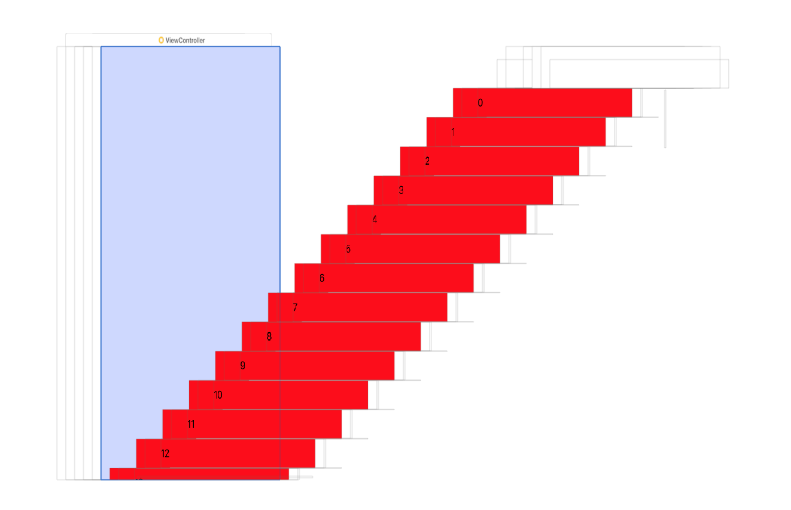
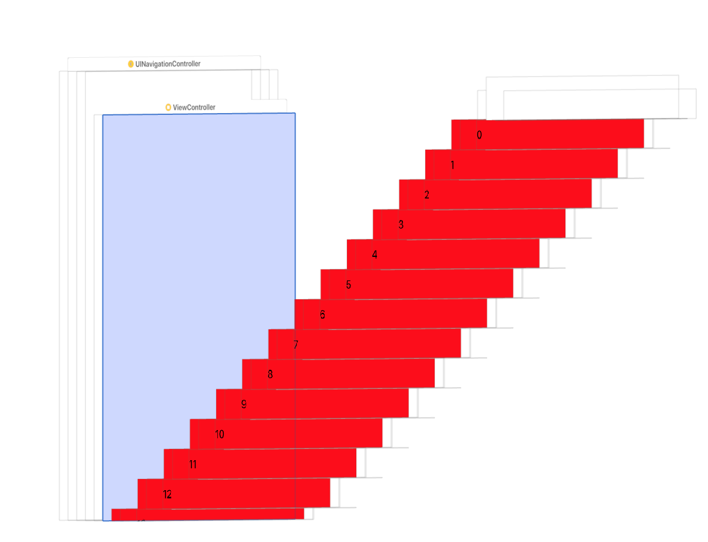
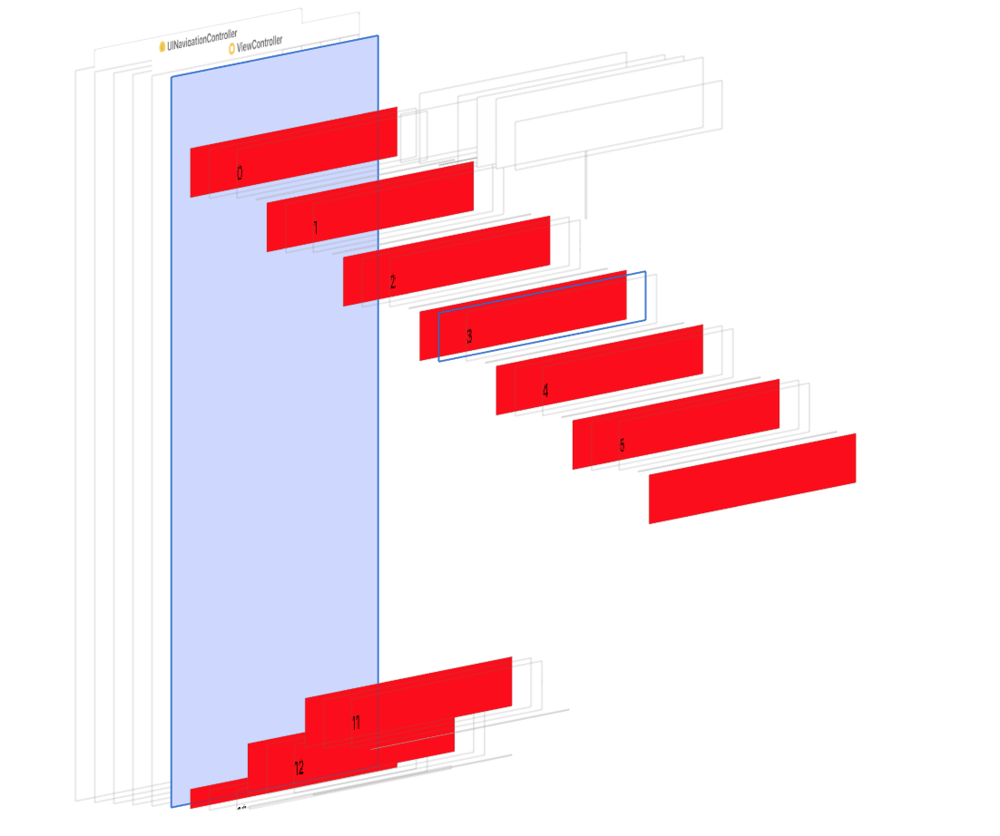
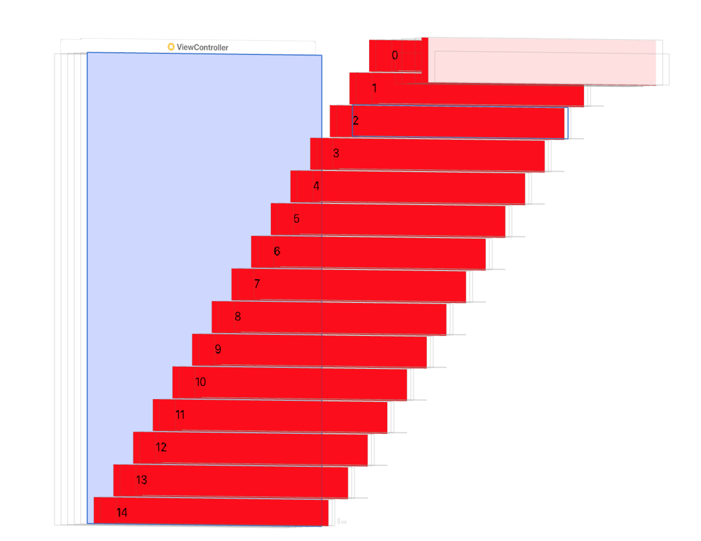

# 问题

## iOS

1. contentInset &  adjustedContentInset
2. 影响导航栏和tableview因素
3. 状态栏颜色
4. **导航栏背景颜色** 与 **图片的capInset**
5. NSURLProtocol

### contentInset & adjustedContentInset & safeAreaInset

1. safeAreaInset

    视图被安全区覆盖的部分，如果一个视图完全在安全区内，则 safeAreaInset 为 0

2. contentInset

3. adjustedContentInset = contentInset + safeAreaInset

### 影响导航栏和tableview因素

#### translucent

1. YES
    
2. NO

    

translucent |UIView(iPhone 8) | UITableView(iPhone 8)
--- |--- | ---
NO | H:603 | H:667
YES | H:667 | H:667 Y:-64(Bounds)

#### contentInsetAdjustmentBehavior

>Constants indicating how safe area insets are added to the adjusted content inset.

1.UIScrollViewContentInsetAdjustmentAlways

> Always include the safe area insets in the content adjustment.

2.UIScrollViewContentInsetAdjustmentNever

>Do not adjust the scroll view insets.

translucent | contentInsetAdjustmentBehavior | UIView(iPhone 8) | UITableView(iPhone 8)
--- |--- | --- | ---
YES | UIScrollViewContentInsetAdjustmentAlways | H:667 | H:667 Y:-64(Bounds)
YES | UIScrollViewContentInsetAdjustmentNever | H:667 | H:667 Y:0(Bounds)
  

#### extendedLayoutIncludesOpaqueBars &contentInsetAdjustmentBehavior &  automaticallyAdjustsScrollViewInsets

``
//    if (@available(iOS 11.0, *)) {//        self.tableView.contentInsetAdjustmentBehavior = UIScrollViewContentInsetAdjustmentNever;
//    } else {
//        self.automaticallyAdjustsScrollViewInsets = NO;
//    }
``

[参考](http://yangzq007.com/2016/10/24/iOS%E6%BB%9A%E5%8A%A8%E8%A7%86%E5%9B%BE%E4%B8%8B%E5%8E%8B%E5%85%A8%E8%A7%A3%E6%9E%90/)

### 状态栏

### **导航栏背景颜色** 与 **图片的capInset**

capInset

### 更新约束

``
updateConstraintsIfNeeded
updateConstraints
needsUpdateConstraints
setNeedsUpdateConstraints
``