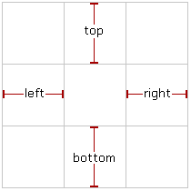

# 问题

## iOS

1. contentInset & adjustedContentInset
2. 影响导航栏和tableview因素
3. 状态栏
4. define a stretchable image (导航栏背景颜色，图片拉伸)
5. NSURLProtocol
6. NSTimer

### contentInset & adjustedContentInset & safeAreaInset

1. safeAreaInset

    视图被安全区覆盖的部分，如果一个视图完全在安全区内，则 safeAreaInset 为 0

2. contentInset

3. adjustedContentInset = contentInset + safeAreaInset

### 影响导航栏和tableview因素

#### translucent

1. YES
    
2. NO

    

translucent |UIView(iPhone 8) | UITableView(iPhone 8)
--- |--- | ---
NO | H:603 | H:667
YES | H:667 | H:667 Y:-64(Bounds)

#### contentInsetAdjustmentBehavior

>Constants indicating how safe area insets are added to the adjusted content inset.

1.UIScrollViewContentInsetAdjustmentAlways

> Always include the safe area insets in the content adjustment.

2.UIScrollViewContentInsetAdjustmentNever

>Do not adjust the scroll view insets.

translucent | contentInsetAdjustmentBehavior | UIView(iPhone 8) | UITableView(iPhone 8)
--- |--- | --- | ---
YES | UIScrollViewContentInsetAdjustmentAlways | H:667 | H:667 Y:-64(Bounds)
YES | UIScrollViewContentInsetAdjustmentNever | H:667 | H:667 Y:0(Bounds)
  

#### extendedLayoutIncludesOpaqueBars &contentInsetAdjustmentBehavior &  automaticallyAdjustsScrollViewInsets

``
//    if (@available(iOS 11.0, *)) {//        self.tableView.contentInsetAdjustmentBehavior = UIScrollViewContentInsetAdjustmentNever;
//    } else {
//        self.automaticallyAdjustsScrollViewInsets = NO;
//    }
``

[参考](http://yangzq007.com/2016/10/24/iOS%E6%BB%9A%E5%8A%A8%E8%A7%86%E5%9B%BE%E4%B8%8B%E5%8E%8B%E5%85%A8%E8%A7%A3%E6%9E%90/)

### 状态栏

|属性|意义|
--- | ---
UIViewControllerBasedStatusBarAppearance（info.plist） | YES(视图控制器决定了状态栏的风格),NO(表示每个视图控制器必须显式地使用UIApplication对象来设置状态栏的风格)
childViewControllerForStatusBarStyle | 当系统需要vc决定status bar的样式调用。
setNeedsStatusBarAppearanceUpdate | 示意系统 vc 的status bar的属性已经改变。

[参考](https://www.jianshu.com/p/c0414830aa74)

### **define a stretchable image** (导航栏背景颜色，图片拉伸)

capInset

1   2   3

4   5   6

7   8   9

不变：1，3，7，9。 5 

变：2，4，6，8

[官方文档](https://developer.apple.com/documentation/uikit/uiimage?changes=_3&language=objc)

[拉伸实验](https://www.jianshu.com/p/a577023677c1)

### 更新约束

``
updateConstraintsIfNeeded
updateConstraints
needsUpdateConstraints
setNeedsUpdateConstraints
``

### NSTimer