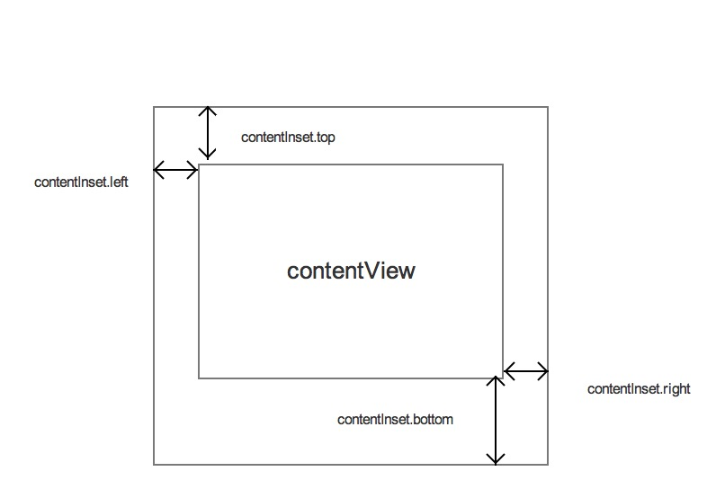

# 时间

标签（空格分隔）： iOS

---

### 类

NSDate                      日期

NSDateFormatter             日期格式

NSCalendar                  日历

NSDateComponents            日期组件

NSTimeZone                  时区

UIDatePicker                时间选择器

### 应用

##### 转换当前`NSDate`的`NSDateComponents`

1. 返回所有 NSDateComponents

    ```Objective-C
    NSDate *currentDate = [NSDate date];
    NSCalendar *calendar = [[NSCalendar alloc] initWithCalendarIdentifier:NSCalendarIdentifierGregorian];
    NSTimeZone *localZone = [NSTimeZone localTimeZone];
    NSDateComponents *currentComp = [calendar componentsInTimeZone:localZone fromDate:currentDate];
    ```

2. 获得指定时间单位的 NSDateComponents

    ```Objective-C
    - (NSDateComponents *)components:(NSCalendarUnit)unitFlags fromDate:(NSDate *)date;
    ```

##### `NSDateComponents` -> `NSDate`

```Objective-C
NSCalendar
- (nullable NSDate *)dateFromComponents:(NSDateComponents *)comps;
```

##### `NSDate` 日期的加减 （当前时间的月份的上一个月)

 ```Objective-C
    NSDate *currentDate = [NSDate date];
    NSDate *previousMonth = [self.calendar dateByAddingUnit:NSCalendarUnitMonth value:-1 toDate:currentDate options:0];
 ```

##### `NSDate` -> 日期字符串

```Objective-C
+(NSString *)formatDate:(NSDate *)date withFormatStr:(NSString *)formatStr
{
    NSDateFormatter *format = [NSDateFormatter new];
    format.locale = [[NSLocale alloc] initWithLocaleIdentifier:@"zh_CN"];
    [format setDateFormat:formatStr];
    NSString *str = [format stringFromDate:date];
    return str;
}
```

##### 日期字符串 -> `NSDate`

```Objective-C
+(NSDate *)dateConversion:(NSString *)formatStr withStr:(NSString *)str
{
    NSDateFormatter *format = [NSDateFormatter new];
    format.locale = [[NSLocale alloc] initWithLocaleIdentifier:@"zh_CN"];
    [format setDateFormat:formatStr];
    NSDate *date = [format dateFromString:str];
    return date;
}
```

##### 获得指定月的最后一天

```Objective-C
    NSRange range = [self.calendar rangeOfUnit:NSCalendarUnitDay inUnit:NSCalendarUnitMonth forDate:[NSDate date]];
    NSTimeZone *timeZone = [NSTimeZone localTimeZone];
    NSDateComponents *comp = [self.calendar componentsInTimeZone:timeZone fromDate:date];
    [comp setDay:range.length];
    NSDate *newdate = [self.calendar dateFromComponents:comp];
    return newdate;
```



### 单词

| 单词       | 词性   |  词义  |
| --------   | -----:  | :----:  |
|gregorian  |   |公历|
|Daylight ||白天|
|creation||
|appropriate||
|Temporal ||
|This API reports if the date is within a weekend period, **as defined by** the calendar and calendar's locale.|||
|Find the range of the weekend around the given date, returned via two by-reference parameters.
	Returns NO if the given date is not in a weekend.
	Note that a given entire Day within a calendar is not necessarily all in a weekend or not; weekends can start in the middle of a Day in some calendars and locales.|||