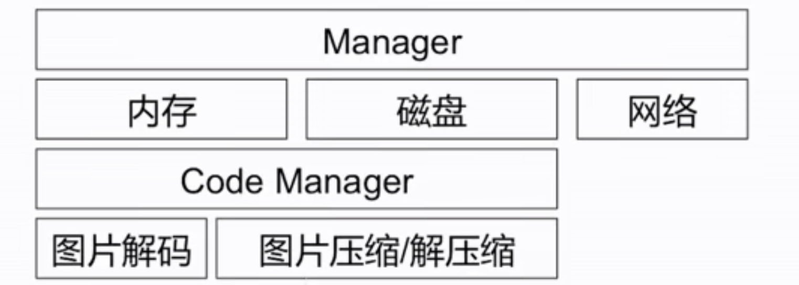
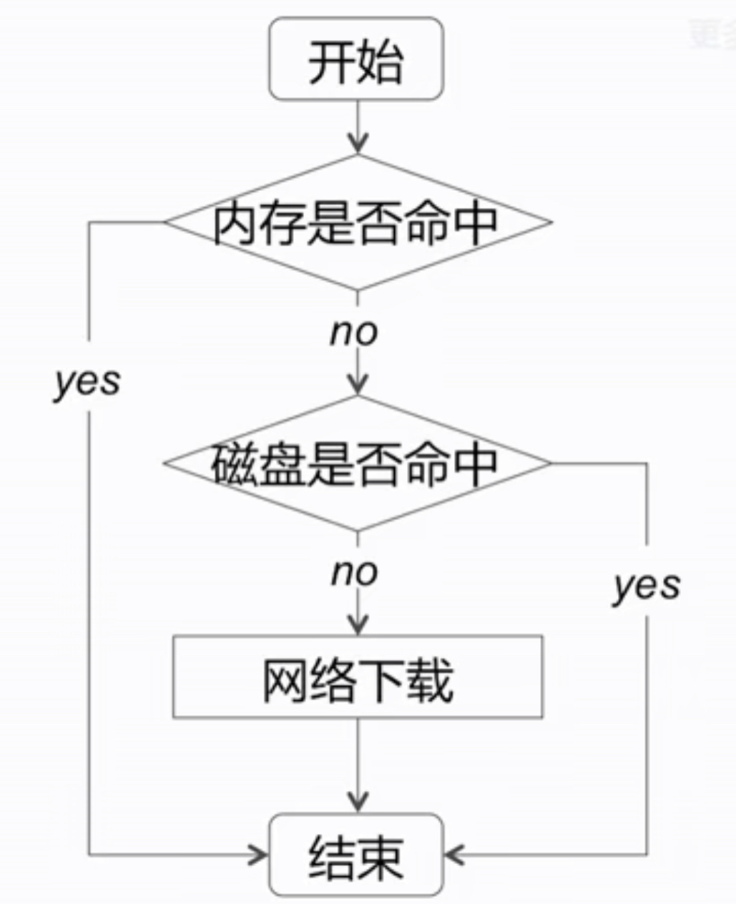
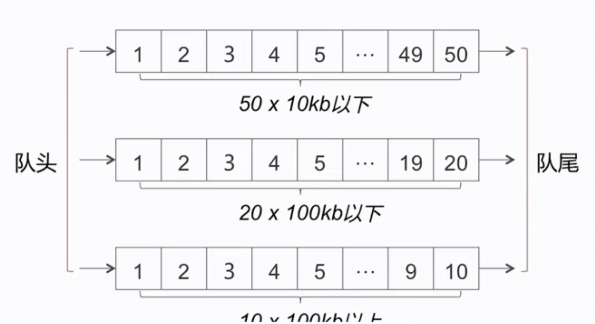
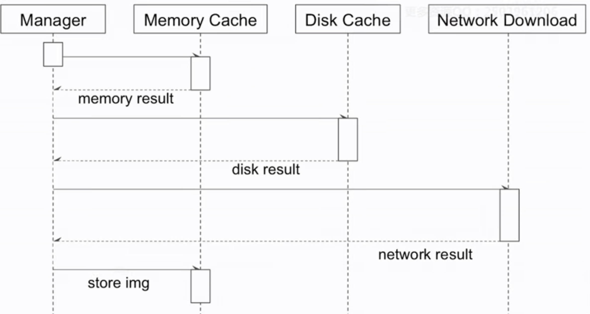

# 架构和框架

- 图片缓存
- 阅读市场统计
- 复杂页面架构
- 客户端整体架构

框架和架构解决的问题

- 模块化
- 结构
- 结偶
- 降低代码的重合度

## 怎样设计一个图片缓存框架

### 图片通过什么方式进行读写，过程是怎样的？

- 以图片的URL的单向Hash值作为key

流程

### 内存的设计需要考虑哪些问题

- 内存的size
- 淘汰策略

#### 内存的size如何设计

#### 淘汰策略

- 以队列先进先出的方式淘汰
- LRU算法(如30分钟之内未使用)
  - 定时检查(不推荐)
  - 提高检查触发频率
    - 每次进行读写时
    - 前后台切换时

Note:注意时间和空间的开销

### 磁盘的设计

#### 磁盘设计需要考虑哪些问题？

- 存储方式
- 存储大小（如100M）
- 淘汰策略

### 网络部分

- 图片请求的最大并发量
- 请求超时策略
- 请求优先级

### 图片解码

#### 对于不同格式的图片，解码采用什么方式来做

- 应用策略模式对不同图片格式进行解码

#### 在哪个阶段做图片解码处理

- 磁盘读取后
- 网络请求返回后

### 线程处理

