# 网络

- HTTP协议
- TTPS与网络安全
- TCP/UDP
- DNS解析
- Session/Cookie

## HTTP

- 请求/响应报文
- 建立连接流程
- HTTP的特点

### 请求/响应报文

请求报文

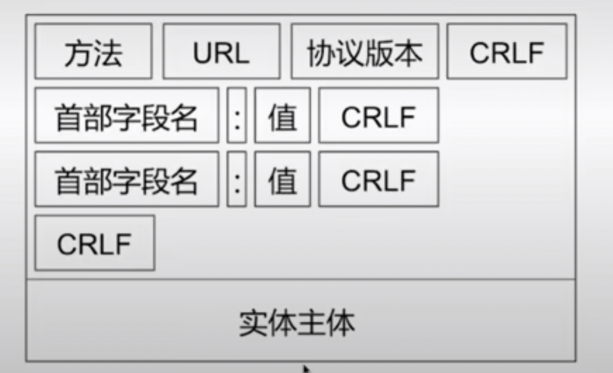

响应报文

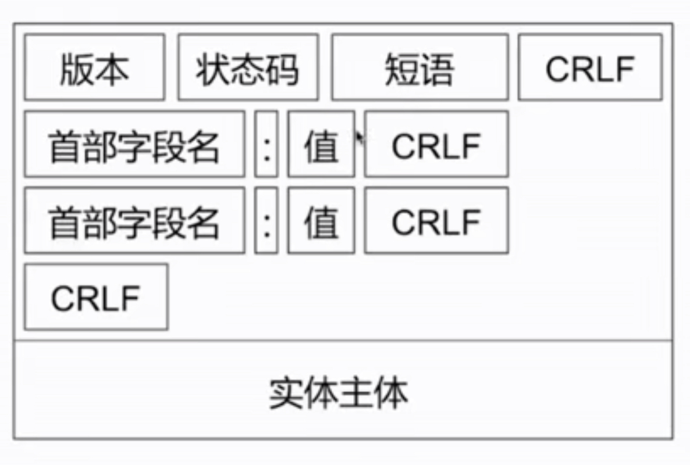

### HTTP 的请求方式都有哪些

- GET
- POST
- HEAD
- PUT
- DELETE
- OPTIONS

### GET 和 POST 方式的区别

GET的请求参数以？分割并拼接到URL后面，POST请求参数在Body里面
GET参数长度限制2048个字符，POST没有限制
GET请求不安全，POST请求比较安全

从语义的角度回答

GET ： 获取资源

安全的，幂等的，可缓存的

POST ： 处理资源的

非安全的，非幂等的 不可缓存的

> 安全的：不应该引起Server端的任何状态变化
> GET，HEAD，OPTIONS
>
> 幂等性：同一个请求方法执行多次和执行一次的效果完全相同
> PUT DELETE
>
>请求是否可以被缓存：
> GET HEAD

### 你都了解那些状态吗，他们的含义是什么

1XX
2XX
3XX (301,302重定向)
4XX (错误)
5XX

## 链接建立流程

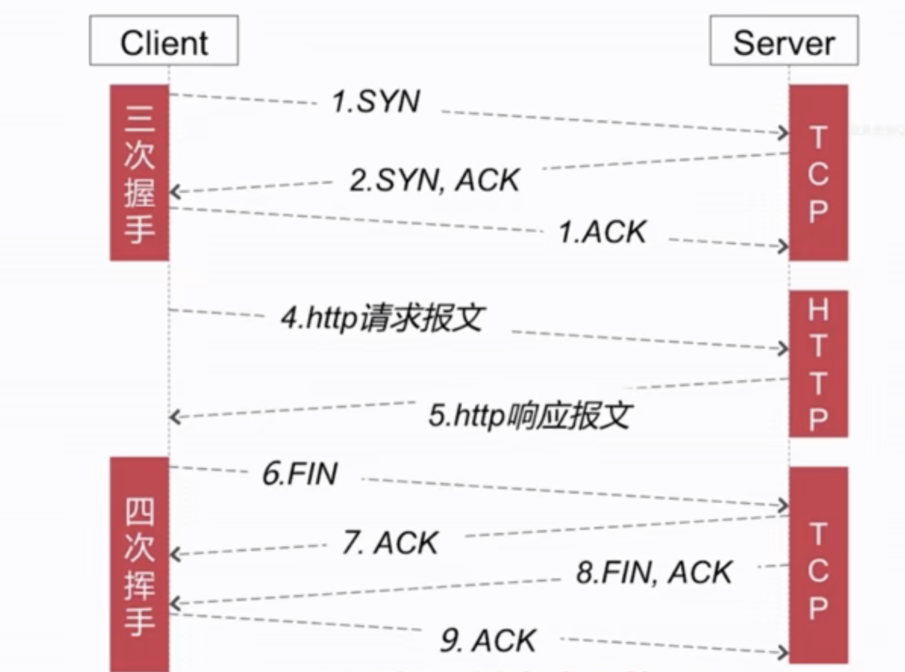

四次挥手

1. 客户端向服务端发送终止报文
2. 服务端收到并向客户端发送确认报文
3. 服务端向客户端发送终止报文
4. 客户端收到并向服务端发送确认报文

### HTTP的特点

无连接（可以通过HTTP的持久连接弥补）
无状态（可以使用Cookie/Session）

#### 持久连接

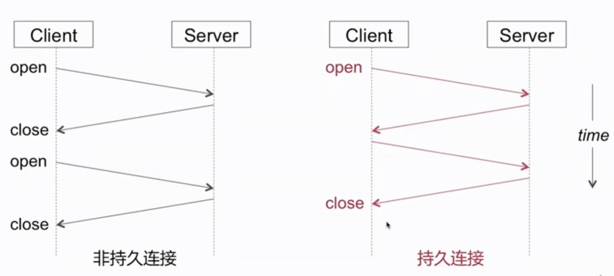

##### 头部字段

- Connection ： keep-alive （期许持久连接)
- time ： 20 （20s以内）
- max ：10 这条链接最多可以同时有多少个http请求和响应对

##### 怎么判断一个请求是否结束

- Content-length：1024 （查看接受的数据是否是该值的大小来判断请求是否完毕）
- chunked，最后会有一个空的chunked

#### Charles抓包原理是怎样的

利用了中间人攻击的漏洞

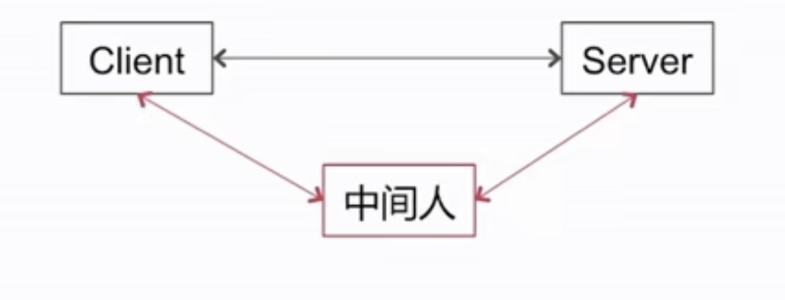

## HTTPS 与 网络安全

### HTTPS 和 HTTP 有怎样的区别

HTTPS = HTTP + SSL / TLS

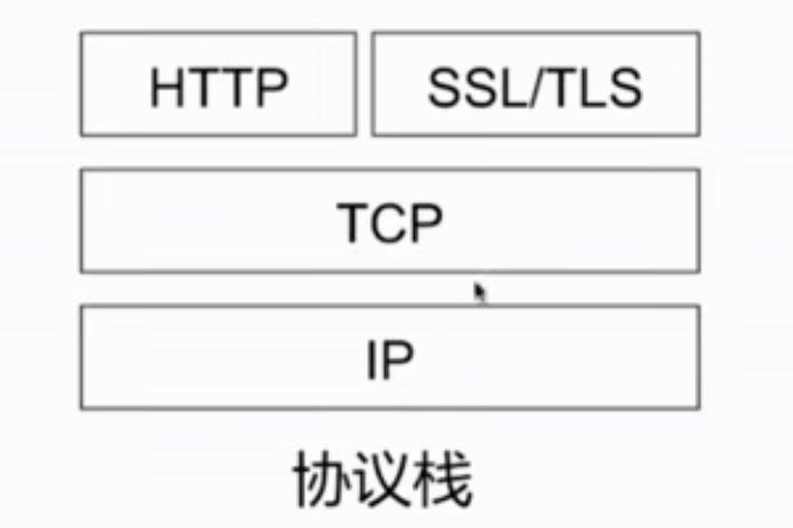

#### HTTPS 建立流程是怎样的

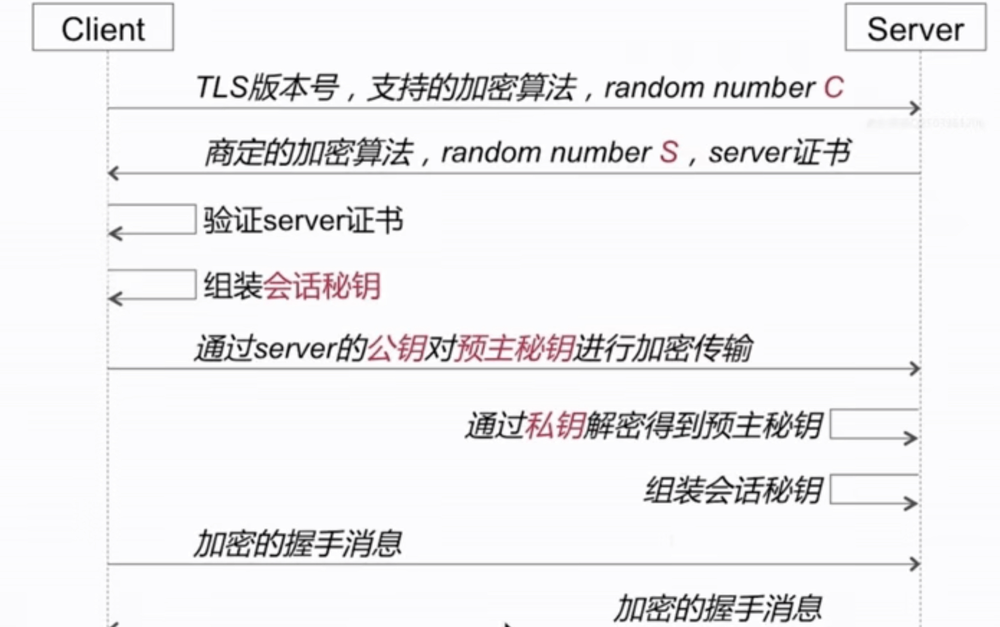

> 会话密钥 = random S + random C + 预主密钥

#### HTTPS 都使用了哪些加密手段？ 为什么？

- 连接建立过程使用非对称加密，非对称加密很耗时
- 后续通信使用对称加密

#### 非对称加密

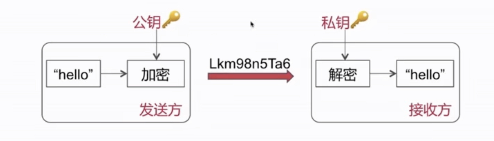

#### 对称加密

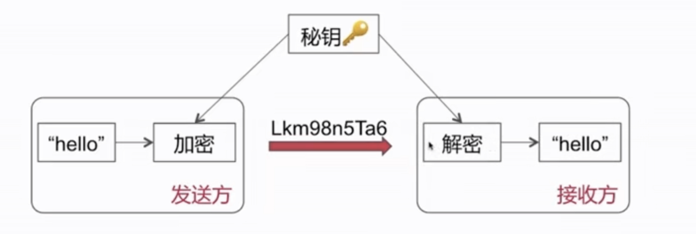

### TCP 和 UDP

TCP和UDP都属于传输层协议

#### UDP

特点

    无连接 尽最大努力交付 面向报文（）

> 面向报文(既不合并，也不拆分)
> 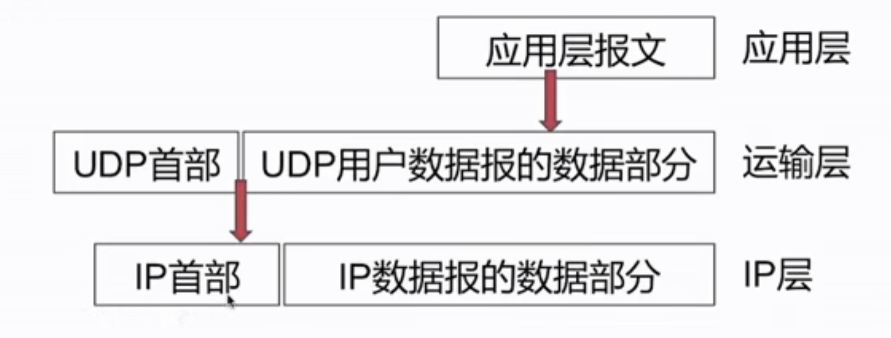

功能

复用，分用

>复用
>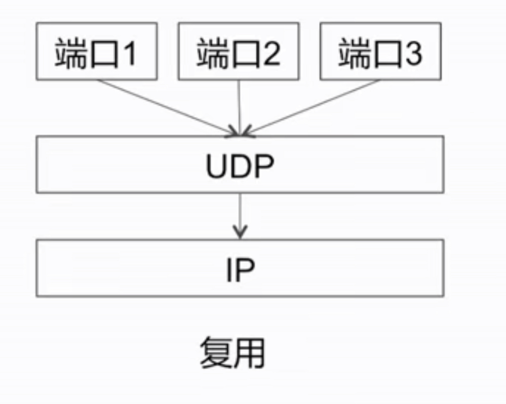
