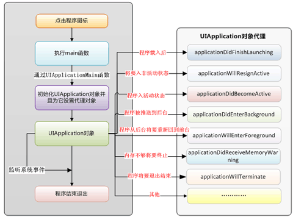

# 面试

## OC的动态类型和Runtime机制

1. 动态类型
2. 动态绑定
3. 动态载入

### 作用

1. 交换方法
2. 创建类
3. 给新创建的类增加方法
4. 改变isa指针

### 详解

#### isa 与 class

```Objective-C
struct objc_class {
    Class isa  OBJC_ISA_AVAILABILITY;
  
#if !__OBJC2__
    Class super_class                                        OBJC2_UNAVAILABLE;
    const char *name                                         OBJC2_UNAVAILABLE;
    long version                                             OBJC2_UNAVAILABLE;
    long info                                                OBJC2_UNAVAILABLE;
    long instance_size                                       OBJC2_UNAVAILABLE;
    struct objc_ivar_list *ivars                             OBJC2_UNAVAILABLE;
    struct objc_method_list **methodLists                    OBJC2_UNAVAILABLE;
    struct objc_cache *cache                                 OBJC2_UNAVAILABLE;
    struct objc_protocol_list *protocols                     OBJC2_UNAVAILABLE;
#endif

} OBJC2_UNAVAILABLE;
```

*ivars: 成员变量列表的指针
*methodLists 指向方法列表的指针

### 参考

[一](https://halfrost.com/objc_runtime_isa_class/)

## block

1. 全局静态 block，不会访问任何外部变量，执行完就销毁。
2. 保存在栈中的 block，当函数返回时会被销毁，和第一种的区别就是调用了外部变量。
3. 保存在堆中的 block，当引用计数为 0 时会被销毁。例如按钮的点击事件，一直存在，即使执行过，也不销毁，因为按钮还可能被点击，持有按钮的View被销毁，它才会被销毁。

[参考](https://www.jianshu.com/p/6bba9b4a25d5)

### block 和 代理如何选择

优先使用block。
如果回调的状态很多，多于三个使用代理。
如果回调的很频繁，次数很多，像UITableview，每次初始化、滑动、点击都会回调，使用代理。

## 属性

1. 原子性---- nonatomic atomic
2. 读/写属性 ---- readwrite(读写) readonly(只读)
3. 内存管理--- strong weak assign copy retain unsafe_unretained
4. 方法名--- getter setter

### nonatomic & atomic

nonatomic:表示非原子，不安全，但是效率高。
atomic:表示原子行，安全，但是效率低。
atomic,不能绝对保证线程的安全，当多线程同时访问的时候，会造成线程不安全。可以使用线程锁来保证线程的安全。

[参考一](http://www.wimhe.com/archives/46)
[参考二:@dynamic & @synthesize](http://www.wimhe.com/archives/47)

## copy & mutableCopy

可变版本: NSCopying协议
不可变版本 NSMutableCopying协议

使用copy时 可变集合的指针地址以及内存地址都不相同 深复制
不可变集合的指针地址不一样但是内存地址一样 属于浅复制

使用mutableCopy的时候无论是可变集合还是不可变集合的指针地址和内存地址都不同 都属于深复制

## 数据持久化

1. plist
2. preference
3. NSKeyedArchiver
4. sqlite
5. coreData

## AppDelegate的方法



## NSCache && NSDictionary

当系统资源将要耗尽时，NSCache可以自动删减缓存
NSCache并不会拷贝键，而是会保留它。不会拷贝键的原因：键是由不支持拷贝操作的对象充当。
NSCache是线程安全的

## Designated [ˈdɛzɪɡˌneɪt ] Initializer[iˈniSHəˌlīz]

[designated initializer 是什么](https://github.com/100mango/zen/blob/master/Objective-C%20%E6%8B%BE%E9%81%97%EF%BC%9Adesignated%20initializer/Objective-C%20%E6%8B%BE%E9%81%97%EF%BC%9Adesignated%20initializer.md)

[designated initializer规则](https://www.jianshu.com/p/57db46f013d7)

1. 每个类的正确初始化过程应当是按照从子类到父类的顺序，依次调用每个类的Designated Initializer。并且用父类的Designated Initializer初始化一个子类对象，也需要遵从这个过程。
2. 如果子类指定了新的初始化器，那么在这个初始化器内部必须调用父类的Designated Initializer。并且需要重写父类的Designated Initializer，将其指向子类新的初始化器。
3. 你可以不自定义Designated Initializer，也可以重写父类的Designated Initializer，但需要调用直接父类的Designated Initializer。
4. 如果有多个Secondary initializers(次要初始化器)，它们之间可以任意调用，但最后必须指向Designated Initializer。在Secondary initializers内不能直接调用父类的初始化器。
5. 如果有多个不同数据源的Designated Initializer，那么不同数据源下的Designated Initializer应该调用相应的[super (designated initializer)]。如果父类没有实现相应的方法，则需要根据实际情况来决定是给父类补充一个新的方法还是调用父类其他数据源的Designated Initializer。比如UIView的initWithCoder调用的是NSObject的init。
6. 需要注意不同数据源下添加额外初始化动作的时机。

[designated initializer](http://www.cnblogs.com/smileEvday/p/designated_initializer.html)

## 分类 Category[ˈkædəˌɡɔri]

1. 将类的实现分散到多个不同文件或多个不同框架中。
2. 创建对私有方法的前向引用。
3. 向对象添加非正式协议。

## UITableView 的优化方法

UITableview的优化方法（缓存高度，异步绘制，减少层级，hide，避免离屏渲染）

## 内存管理

### 内存管理范围

只有oc对象需要进行内存管理
非oc对象类型比如基本数据类型不需要进行内存管理

### 内存管理本质

Objective-C的对象在内存中是以堆的方式分配空间的,并且堆内存是由你释放的，就是release
OC对象存放于堆里面(堆内存要程序员手动回收)
非OC对象一般放在栈里面(栈内存会被系统自动回收)
堆里面的内存是动态分配的，所以也就需要程序员手动的去添加内存、回收内存

### 堆和栈的区别

1. 栈上分配的空间是临时的，在函数退出后将被系统释放，不会造成内存泄露，因为栈的空间小所以在栈上不能获得大量的内存块，堆是在整个进程的未分配空间中分配的内存
2. 堆主要用来存放对象的，栈主要是用来执行程

### 内存分配以及管理方式

#### 按分配方式分

堆是动态分配和回收内存的，没有静态分配的堆
栈有两种分配方式：静态分配和动态分配
静态分配是系统编译器完成的，比如局部变量的分配
动态分配是有alloc函数进行分配的，但是栈的动态分配和堆是不同的，它的动态分配也由系统编译器进行释放，不需要程序员手动管理

#### 按管理方式分

对于栈来讲，是由系统编译器自动管理，不需要程序员手动管理
对于堆来讲，释放工作由程序员手动管理，不及时回收容易产生内存泄露
堆：是大家共有的空间，分全局堆和局部堆。全局堆就是所有没有分配的空间，局部堆就是用户分配的空间。堆在操作系统对进程 初始化的时候分配，运行过程中也可以向系统要额外的堆，但是记得用完了要还给操作系统，要不然就是内存泄漏。堆里面一般 放的是静态数据，比如static的数据和字符串常量等，资源加载后一般也放在堆里面。一个进程的所有线程共有这些堆 ，所以对堆的操作要考虑同步和互斥的问题。程序里面编译后的数据段都是堆的一部分。
栈：是个线程独有的，保存其运行状态和局部自动变量的。栈在线程开始的时候初始化，每个线程的栈互相独立，因此 ，栈是　thread safe的。每个c++对象的数据成员也存在在栈中，每个函数都有自己的栈，栈被用来在函数之间传递参数。操作系统在切换线程的时候会自动的切换栈，就是切换ss/esp寄存器。栈空间不需要在高级语言里面显式的分配 和释放。
一句话总结就是

堆：由程序员分配和释放,如果不释放可能会引起内存泄漏 栈：由编译器自动分配和释放，一般存放参数值，局部变量

## 类结构

## 进程 & 线程

## RunLoop

## KVO 实现原理

## 开源框架

### AFNetworking

AFNetworking 为什么添加常驻线程？

如果没有常住线程的话，就会每次请求网络就去开辟线程，完成之后销毁开辟线程，这样就造成资源的浪费，而开辟一条常驻线程，就可以避免这种浪费，我们可以在每次的网络请求都添加到这条线程。

[AFNetworking 到底做了什么？](http://www.cocoachina.com/ios/20161209/18277.html)

## 其他面试题
[面试题](http://www.cocoachina.com/ios/20180425/23171.html)