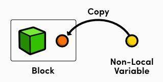
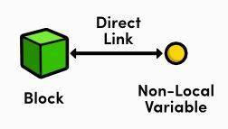
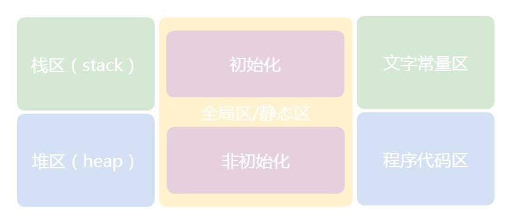
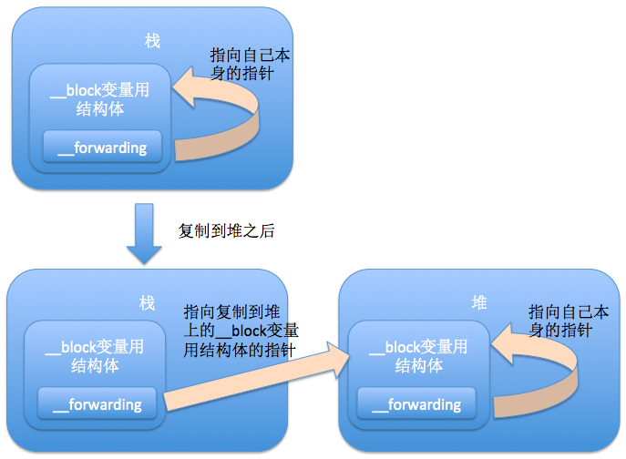
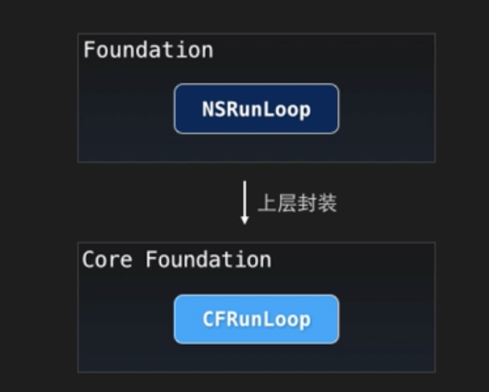
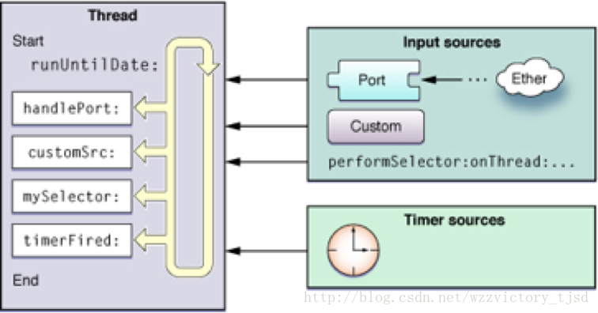

# 面试

## OC的动态类型和Runtime机制

### 动态类型

1. 动态类型
2. 动态绑定
3. 动态载入

### Runtime作用举例

1. 交换方法
2. 创建类
3. 给新创建的类增加方法
4. 改变isa指针

### Runtime详解

#### OC 在三个层面与Runtime交互

1. 通过 Objective-C 源代码
2. Foundation库
3. 通过对 Runtime 库函数的直接调用

#### isa 与 class

##### NSObject 起源

###### NSObject2.0之前

```Objective-C

// NSObject定义
typedef struct objc_class *Class;

@interface NSObject <NSObject> {
    Class isa  OBJC_ISA_AVAILABILITY;
}

```

```C/C++
// objc_class源码
struct objc_class {
    Class isa  OBJC_ISA_AVAILABILITY;
  
#if !__OBJC2__
    Class super_class                                        OBJC2_UNAVAILABLE;
    const char *name                                         OBJC2_UNAVAILABLE;
    long version                                             OBJC2_UNAVAILABLE;
    long info                                                OBJC2_UNAVAILABLE;
    long instance_size                                       OBJC2_UNAVAILABLE;
    struct objc_ivar_list *ivars                             OBJC2_UNAVAILABLE;
    struct objc_method_list **methodLists                    OBJC2_UNAVAILABLE;
    struct objc_cache *cache                                 OBJC2_UNAVAILABLE;
    struct objc_protocol_list *protocols                     OBJC2_UNAVAILABLE;
#endif

} OBJC2_UNAVAILABLE;
```

*ivars: 成员变量列表的指针
*methodLists 指向方法列表的指针

###### NSObject2.0

```Objective-C
typedef struct objc_class *Class;
typedef struct objc_object *id;

@interface Object {
    Class isa;
}

@interface NSObject <NSObject> {
    Class isa  OBJC_ISA_AVAILABILITY;
}

struct objc_object {
private:
    isa_t isa;
}

struct objc_class : objc_object {
    // Class ISA;
    Class superclass;          // 父类
    cache_t cache;             // 方法缓存
    class_data_bits_t bits;    // 实例方法链表
}

union isa_t
{
    isa_t() { }
    isa_t(uintptr_t value) : bits(value) { }
    Class cls;
    uintptr_t bits;
}
```

### runtime 参考

[Runtime 详解 一](https://halfrost.com/objc_runtime_isa_class/)
[面试题](https://www.jianshu.com/p/255f39005018)

## 类别（Category）和扩展（Extension）

### category

格式：.h 和 .m 文件；  类名 (类别名)
作用：为继承自某类的所有子类添加公有的方法
局限：一般只能扩展方法

### extension

格式：.h 文件；类名 ()
作用：能为某个类附加额外的属性，成员变量，方法声明
局限：类扩展只能针对自定义的类

## block

### block 详解

#### block 与变量

##### 默认情况



```Objective-C
int age = 10;
myBlock block = ^{
    NSLog(@"age = %d", age);
};
age = 18;
block();

10 //结果
```

##### __block 修饰的外部变量



```Objective-C
__block int age = 10;
myBlock block = ^{
    NSLog(@"age = %d", age);
};
age = 18;
block();

18 //结果
```

#### block 的 copy



block 的分类 以及所处内存

1. 全局静态 block，不会访问任何外部变量，执行完就销毁。
2. 保存在栈中的 block，当函数返回时会被销毁，和第一种的区别就是调用了外部变量。
3. 保存在堆中的 block，当引用计数为 0 时会被销毁。例如按钮的点击事件，一直存在，即使执行过，也不销毁，因为按钮还可能被点击，持有按钮的View被销毁，它才会被销毁。

block 内存与是否引用外界变量

1. block 不访问外界变量
   1. block 在全局块中
2. block 访问外界变量：
   1. ARC：堆区 （从栈区copy到堆区）
   2. MRC：栈区 （为了延长生命周期，需要从栈copy到堆）

block 与forwarding


#### 防止 block 循环引用

ARC 下：使用 __weak

```Objective-C
__weak typeof(self) weakSelf = self;
self.someBlock = ^(Type var){
   [weakSelf dosomething];
};
```

MRC 下：使用 __block

ARC下，使用 __block **也有可能带来的循环引用**

### block 和 代理如何选择

优先使用block。
如果回调的状态很多，多于三个使用代理。
如果回调的很频繁，次数很多，像UITableview，每次初始化、滑动、点击都会回调，使用代理。

### block 参考

[block 和 delegate 的区别](https://www.jianshu.com/p/6bba9b4a25d5)
[block详解](https://juejin.im/entry/588075132f301e00697f18e0)
[栈，堆，队列](http://www.imlifengfeng.com/blog/?p=147)

## 属性

1. 原子性---- nonatomic atomic
2. 读/写属性 ---- readwrite(读写) readonly(只读)
3. 内存管理--- strong weak assign copy retain unsafe_unretained
4. 方法名--- getter setter

属性的排列顺序：原子性，读写 和 内存管理

### weak vs assign

1. 不同点:
   1. weak 非拥有关系(nonowning relationship)。这种属性设置新值时，设置方法既不保留新值，也不释放旧值。然而在属性所指的对象遭到摧毁时，属性值也会清空(nil out)。而 assign 的“设置方法”只会执行针对“纯量类型”(scalar type，例如 CGFloat 或 NSlnteger 等)的简单赋值操作
   2. assign 可以用非 OC 对象,而 weak 必须用于 OC 对象

### nonatomic & atomic

nonatomic:表示非原子，不安全，但是效率高。
atomic:表示原子行，安全，但是效率低。
atomic,不能绝对保证线程的安全，当多线程同时访问的时候，会造成线程不安全。可以使用线程锁来保证线程的安全。

[参考一](http://www.wimhe.com/archives/46)
[参考二:@dynamic & @synthesize](http://www.wimhe.com/archives/47)

### copy

1. 用途
   1. NSString、NSArray、NSDictionary 等等经常使用copy关键字（源对象是不可变，浅复制；源对象是可变，深复制）
   2. block 也经常使用 copy 关键字（将 block 从栈中 copy 到堆中）

`@property (copy) NSMutableArray *array;` 会造成的问题

1. 添加,删除,修改数组内的元素的时候,程序会因为找不到对应的方法而崩溃.因为 copy 就是复制一个不可变 NSArray 的对象。
2. 使用了 atomic 属性会严重影响性能

### copy & mutableCopy

自定义的对象分为可变版本与不可变版本，那么就要同时实现 NSCopying 与 NSMutableCopying 协议

1. 对非集合类对象的copy操作
    - [immutableObject copy] // 浅复制
    - [immutableObject mutableCopy] //深复制
    - [mutableObject copy] //深复制
    - [mutableObject mutableCopy] //深复制
2. 集合类对象的copy与mutableCopy
    - [immutableObject copy] // 浅复制
    - [immutableObject mutableCopy] //单层深复制
    - [mutableObject copy] //单层深复制
    - [mutableObject mutableCopy] //单层深复制

## 数据持久化

1. plist
2. preference
3. NSKeyedArchiver
4. sqlite
5. coreData

## AppDelegate的方法


## NSCache && NSDictionary

当系统资源将要耗尽时，NSCache可以自动删减缓存
NSCache并不会拷贝键，而是会保留它。不会拷贝键的原因：键是由不支持拷贝操作的对象充当。
NSCache是线程安全的

## Designated [ˈdɛzɪɡˌneɪt ] Initializer[iˈniSHəˌlīz]

[designated initializer 是什么](https://github.com/100mango/zen/blob/master/Objective-C%20%E6%8B%BE%E9%81%97%EF%BC%9Adesignated%20initializer/Objective-C%20%E6%8B%BE%E9%81%97%EF%BC%9Adesignated%20initializer.md)

[designated initializer规则](https://www.jianshu.com/p/57db46f013d7)

1. 每个类的正确初始化过程应当是按照从子类到父类的顺序，依次调用每个类的Designated Initializer。并且用父类的Designated Initializer初始化一个子类对象，也需要遵从这个过程。
2. 如果子类指定了新的初始化器，那么在这个初始化器内部必须调用父类的Designated Initializer。并且需要重写父类的Designated Initializer，将其指向子类新的初始化器。
3. 你可以不自定义Designated Initializer，也可以重写父类的Designated Initializer，但需要调用直接父类的Designated Initializer。
4. 如果有多个Secondary initializers(次要初始化器)，它们之间可以任意调用，但最后必须指向Designated Initializer。在Secondary initializers内不能直接调用父类的初始化器。
5. 如果有多个不同数据源的Designated Initializer，那么不同数据源下的Designated Initializer应该调用相应的[super (designated initializer)]。如果父类没有实现相应的方法，则需要根据实际情况来决定是给父类补充一个新的方法还是调用父类其他数据源的Designated Initializer。比如UIView的initWithCoder调用的是NSObject的init。
6. 需要注意不同数据源下添加额外初始化动作的时机。

[designated initializer](http://www.cnblogs.com/smileEvday/p/designated_initializer.html)

## 分类 Category[ˈkædəˌɡɔri]

1. 将类的实现分散到多个不同文件或多个不同框架中。
2. 创建对私有方法的前向引用。
3. 向对象添加非正式协议。

## UITableView 的优化方法

UITableview的优化方法（缓存高度，异步绘制，减少层级，hide，避免离屏渲染）

## 内存管理

### 内存管理范围

只有oc对象需要进行内存管理
非oc对象类型比如基本数据类型不需要进行内存管理

### 内存管理本质

Objective-C的对象在内存中是以堆的方式分配空间的,并且堆内存是由你释放的，就是release
OC对象存放于堆里面(堆内存要程序员手动回收)
非OC对象一般放在栈里面(栈内存会被系统自动回收)
堆里面的内存是动态分配的，所以也就需要程序员手动的去添加内存、回收内存

### 堆和栈的区别

1. 栈上分配的空间是临时的，在函数退出后将被系统释放，不会造成内存泄露，因为栈的空间小所以在栈上不能获得大量的内存块，堆是在整个进程的未分配空间中分配的内存
2. 堆主要用来存放对象的，栈主要是用来执行程

### 内存分配以及管理方式

#### 按分配方式分

堆是动态分配和回收内存的，没有静态分配的堆
栈有两种分配方式：静态分配和动态分配
静态分配是系统编译器完成的，比如局部变量的分配
动态分配是有alloc函数进行分配的，但是栈的动态分配和堆是不同的，它的动态分配也由系统编译器进行释放，不需要程序员手动管理

#### 按管理方式分

对于栈来讲，是由系统编译器自动管理，不需要程序员手动管理
对于堆来讲，释放工作由程序员手动管理，不及时回收容易产生内存泄露
堆：是大家共有的空间，分全局堆和局部堆。全局堆就是所有没有分配的空间，局部堆就是用户分配的空间。堆在操作系统对进程 初始化的时候分配，运行过程中也可以向系统要额外的堆，但是记得用完了要还给操作系统，要不然就是内存泄漏。堆里面一般 放的是静态数据，比如static的数据和字符串常量等，资源加载后一般也放在堆里面。一个进程的所有线程共有这些堆 ，所以对堆的操作要考虑同步和互斥的问题。程序里面编译后的数据段都是堆的一部分。
栈：是个线程独有的，保存其运行状态和局部自动变量的。栈在线程开始的时候初始化，每个线程的栈互相独立，因此 ，栈是　thread safe的。每个c++对象的数据成员也存在在栈中，每个函数都有自己的栈，栈被用来在函数之间传递参数。操作系统在切换线程的时候会自动的切换栈，就是切换ss/esp寄存器。栈空间不需要在高级语言里面显式的分配 和释放。
一句话总结就是

堆：由程序员分配和释放,如果不释放可能会引起内存泄漏 栈：由编译器自动分配和释放，一般存放参数值，局部变量

### NSAutoreleasePool/@autoreleasepool/autorelease理解与管理

NSAutoreleasePool 是 Cocoa 用来支持引用计数内存管理机制的类, 当一个autorelease pool(自动释放池)被drain(销毁)的时候会对pool里的对象发送一条release的消息.

## 进程 & 线程

[多线程](./多线程.md)

## RunLoop

### Runloop 特点

runloop 为线程而生
Cocoa 和CoreFundation 都提供了 runloop 对象
每个线程，包括程序的主线程（main thread）都有与之相应的run loop对象
主线程的run loop默认是启动的


### Runloop 构成元素

### 获得 Runloop 对象

在任何线程,都可以通过
`NSRunLoop   *runloop = [NSRunLoop currentRunLoop];`
获得 runloop

### 线程安全

Cocoa 中的 NSRunLoop 类并 **不是线程安全** 的
CoreFundation 中的不透明类 **CFRunLoopRef** 是线程安全的
两种类型的run loop完全可以混合使用。
Cocoa 中的 NSRunLoop 类可以通过实例方法
`- (CFRunLoopRef)getCFRunLoop;` 获得对应的 CFRunLoopRef 类，来达到线程安全的目的

### runloop 源

runloop 接受事件来自两种不同的源:输入源(input source) 和 定时源 (timer source)



### Runloop 的管理

1. 启动 Runloop
2. 输入响应事件
3. while/for 语句驱动

```Objective-C
     BOOL isRunning = NO;

      do {

            isRunning = [[NSRunLoopcurrentRunLoop] runMode:NSDefaultRunLoopModebeforeDate:[NSDatedistantFuture]];

     } while (isRunning);
```

### runloop 输入源

#### 基于端口的输入源
#### 自定义输入源
#### Cocoa上的Selector源

### runloop 的mode

- NSDefaultRunLoopMode：App 的默认 Mode，通常主线程是在这个 Mode 下运行(默认情况下运行)
- UITrackingRunLoopMode：界面跟踪 Mode，用于 ScrollView 追踪触摸滑动，保证界面滑动时不受其他 Mode 影响(操作 UI 界面的情况下运行)
- UIInitializationRunLoopMode：在刚启动 App 时进入的第一个 Mode，启动完成后就不再使用（私有）
- GSEventReceiveRunLoopMode：接受系统事件的内部 Mode，通常用不到(绘图服务)
- NSRunLoopCommonModes：这是一个占位用的 Mode，不是一种真正的 Mode (RunLoop无法启动该模式，设置这种模式下，默认和操作 UI 界面时线程都可以运行，但无法改变 RunLoop 同时只能在一种模式下运行的本质 默认包含NSDefaultRunLoopMode,UITrackingRunLoopMode)

### runloop 参考

[runloop详解](https://blog.csdn.net/wzzvictory/article/details/9237973)
[runloop demo1](https://www.jianshu.com/p/902741bcf707)
[runloop demo2 让Timer正常运转](https://www.jianshu.com/p/b2d431d6fa09)
[Event loop](https://en.wikipedia.org/wiki/Event_loop)

## KVO 实现原理

## 适配 iPhone X


### 安全区

## UI动画

## 64-bit tips

### 适配 64位

[文章](http://blog.sunnyxx.com/2014/12/20/64-bit-tips/)

## 开源框架

### AFNetworking

AFNetworking 为什么添加常驻线程？

如果没有常住线程的话，就会每次请求网络就去开辟线程，完成之后销毁开辟线程，这样就造成资源的浪费，而开辟一条常驻线程，就可以避免这种浪费，我们可以在每次的网络请求都添加到这条线程。

[AFNetworking 到底做了什么？](http://www.cocoachina.com/ios/20161209/18277.html)

## 其他面试题

[面试题](http://www.cocoachina.com/ios/20180425/23171.html)

[招聘一个靠谱的iOS一](https://github.com/ChenYilong/iOSInterviewQuestions/blob/master/01%E3%80%8A%E6%8B%9B%E8%81%98%E4%B8%80%E4%B8%AA%E9%9D%A0%E8%B0%B1%E7%9A%84iOS%E3%80%8B%E9%9D%A2%E8%AF%95%E9%A2%98%E5%8F%82%E8%80%83%E7%AD%94%E6%A1%88/%E3%80%8A%E6%8B%9B%E8%81%98%E4%B8%80%E4%B8%AA%E9%9D%A0%E8%B0%B1%E7%9A%84iOS%E3%80%8B%E9%9D%A2%E8%AF%95%E9%A2%98%E5%8F%82%E8%80%83%E7%AD%94%E6%A1%88%EF%BC%88%E4%B8%8A%EF%BC%89.md#1-%E9%A3%8E%E6%A0%BC%E7%BA%A0%E9%94%99%E9%A2%98)

[招聘一个靠谱的iOS二](https://github.com/ChenYilong/iOSInterviewQuestions/blob/master/01%E3%80%8A%E6%8B%9B%E8%81%98%E4%B8%80%E4%B8%AA%E9%9D%A0%E8%B0%B1%E7%9A%84iOS%E3%80%8B%E9%9D%A2%E8%AF%95%E9%A2%98%E5%8F%82%E8%80%83%E7%AD%94%E6%A1%88/%E3%80%8A%E6%8B%9B%E8%81%98%E4%B8%80%E4%B8%AA%E9%9D%A0%E8%B0%B1%E7%9A%84iOS%E3%80%8B%E9%9D%A2%E8%AF%95%E9%A2%98%E5%8F%82%E8%80%83%E7%AD%94%E6%A1%88%EF%BC%88%E4%B8%8B%EF%BC%89.md)

[禅与 Objective-C 编程艺术](https://github.com/oa414/objc-zen-book-cn)