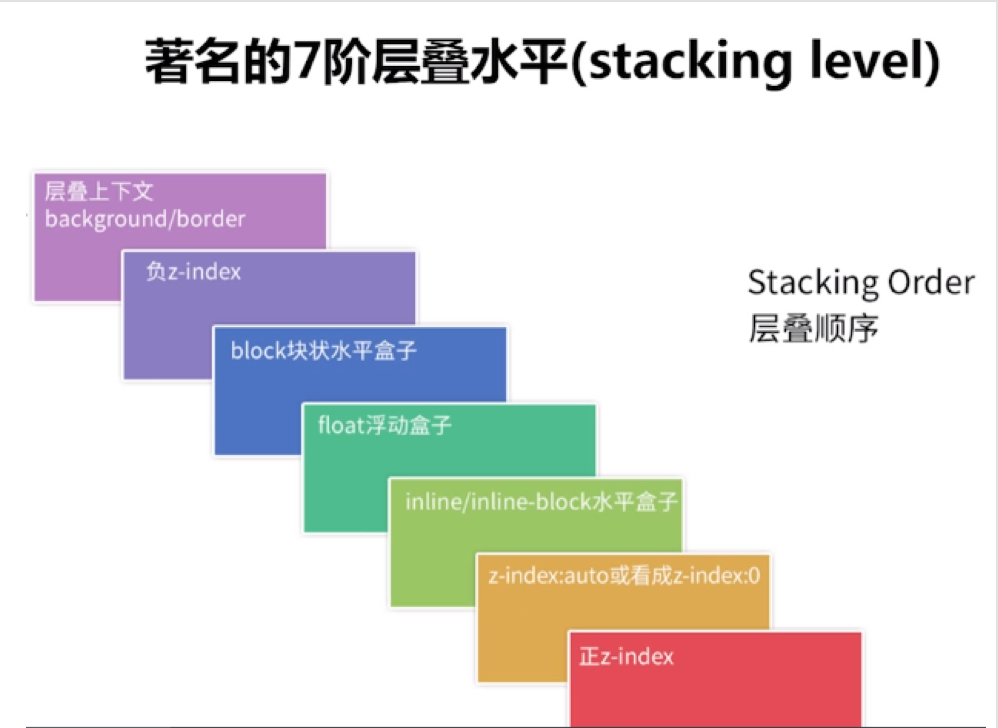

# CSS

## web横排布局
[自适应布局webkit-box的用法](https://www.cnblogs.com/leena/p/6123005.html)

## css权重
> 权重记忆口诀。从0开始，一个行内样式+1000，一个id+100，一个属性选择器/class或者伪类+10，一个元素名，或者伪元素+1

`body #content .data img:hover`

> 最终的权重值是0122；#content是一个id选择器加了100，.data是一个class类选择器加了10，：hover伪类选择器加了10， body和img是元素加了1

[参考](http://www.w3cplus.com/css/css-specificity-things-you-should-know.html)

## this 和 $(this) 的区别

this 是 dom对象
$(this) 是jq对象

## a标签 link hover visited

link 显示
hover 鼠标悬停
visited 点击过

## BFC

## 清除浮动

## offset scrollLeft animate

默认情况下，所有 HTML 元素的位置都是静态的，并且无法移动。如需对位置进行操作，记得首先把元素的 CSS position 属性设置为 relative、fixed 或 absolute

`animate({params},speed,callback)`

## 页面各种宽高

网页可见区域宽： document.body.clientWidth
网页可见区域高： document.body.clientHeight
网页可见区域宽： document.body.offsetWidth (包括边线的宽)
网页可见区域高： document.body.offsetHeight (包括边线的高)
网页正文全文宽： document.body.scrollWidth
网页正文全文高： document.body.scrollHeight
网页被卷去的高： document.body.scrollTop
网页被卷去的左： document.body.scrollLeft
网页正文部分上： window.screenTop
网页正文部分左： window.screenLeft
屏幕物理分辨率的高： window.screen.height
屏幕物理分辨率的宽： window.screen.width
屏幕可用工作区高度： window.screen.availHeight
屏幕可用工作区宽度： window.screen.availWidth
屏幕缩放因子：window.devicePixelRatio
屏幕逻辑分辨率：window.screen.width * window.devicePixelRatio (缩放因子与物理分辨率的乘积)

## 页面层叠水平

## 二级菜单不悬浮 z-index 和 position: absolute
