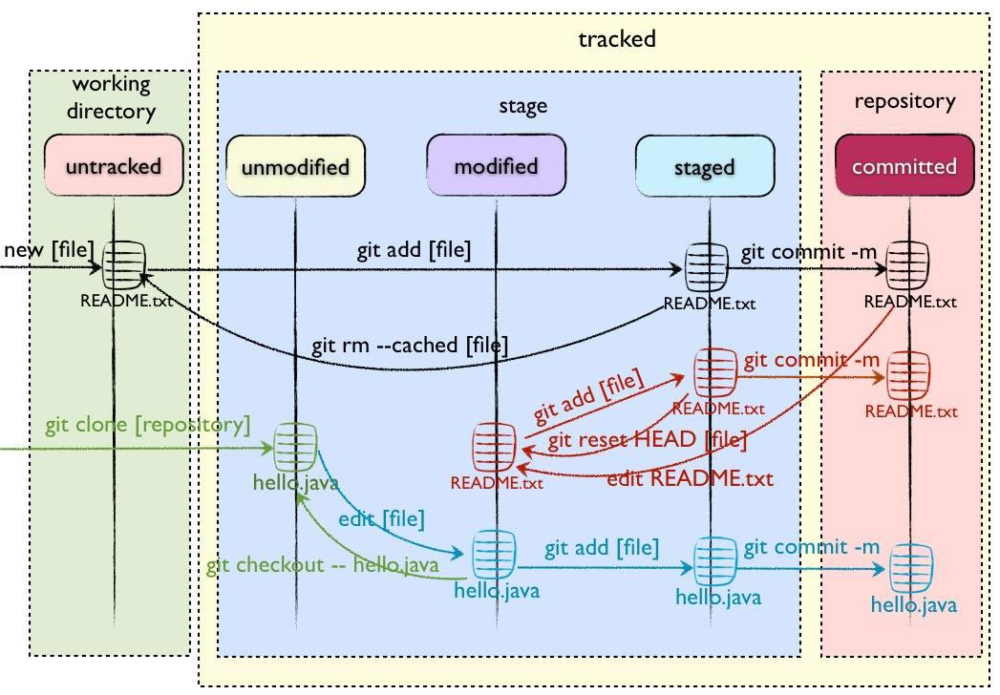

# git 的使用

## git的不同区

- Working Directory
- Stage/Index
- Repository/Git Directory
- Remote Directory


## 不同状态与工作流程



- Untracked
- Unmodify
- Modified
- Staged

## 教程

[git-book](https://git-scm.com/book/zh/v2)
[git教程](http://www.yiibai.com/git/git_push.html)

## git 常用命令

- git 将本地仓库添加到远程
- git 查看远程分支和对应的名称
- git 查看历史
- git推送
- git pull
- git fetch
- git diff
- git merge
- git restore
- git重置到某次提交
- git查看状态


### git 将本地仓库添加到远程

`git remote add origin url`

- origin:是远程仓库链接的别名
- url:远程仓库的链接

`git push -u origin master`

-u 参数指定一个默认主机，这样后面就可以不加任何参数使用git push

### git 查看远程分支和对应的名称

`git remote -v`

``` Command
漫读	http://192.168.6.10:8083/ios/mandu.git (fetch)
漫读	http://192.168.6.10:8083/ios/mandu.git (push)
码云	https://gitee.com/null_788_9135/xs.git (fetch)
码云	https://gitee.com/null_788_9135/xs.git (push)
```

### git 查看历史

`git log`

`git log --graph`

- --graph 图形化log

### git推送

`git push origin master`

- origin:远程分支名称
- master:本地分支名称

#### 强制推送

`git push origin master -f`

- -f: 强制推送参数

### git pull

命令用于从远程获取代码并合并本地的版本。

`git pull origin master`

- origin:(远程分支名字)
- master:本地分支名，可以省略

### git fetch 

`git fetch remoteName branchName : localBranchName`

将远程分支branchName拉取到本地指定localBranchName分支

### git diff

比较stage和work directory里文件的差别

`git diff branchName`

### git merge

`git merge branchName`

合并branchname分支到当前分支

合并

### git restore

撤销修改

### git重置到某次提交

1. git 重置上一次提交(一个^) `git reset --hard HEAD^`
2. git 重置上上一次提交 (两个^^) `git reset --hard HEAD^^`
3. git 重置之前第100一个提交(HEAD~100) `git reset --hard HEAD~100`

### git查看状态

`git status`

## 问题

- git无法pull仓库refusing to merge unrelated histories
- git 遇到数字文件名

### git无法pull仓库refusing to merge unrelated histories

原因：合并两个不同的开始提交的仓库，git会给出 refusing to merge unrelated histories 的提示
举例：因为刚创建的github的仓库有.gitignore 和License，本体是一个写了东西的仓库。
这个时候remote和local没有一个共同的commit。所以
git不能提交（git认为写错了origin）。这时候需要使用 `--allow-unrelated-histories` 命令。
告诉 git 这两个 repository 确定合并
命令：`git pull origin master --allow-unrelated-histories`

### git 遇到数字文件名

`git config --global core.quotepath false`
