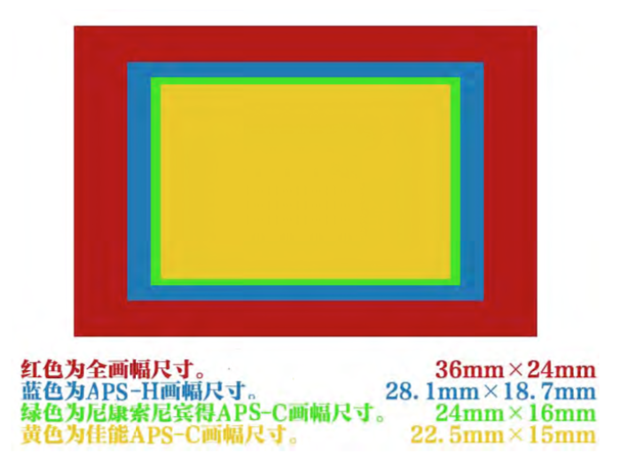
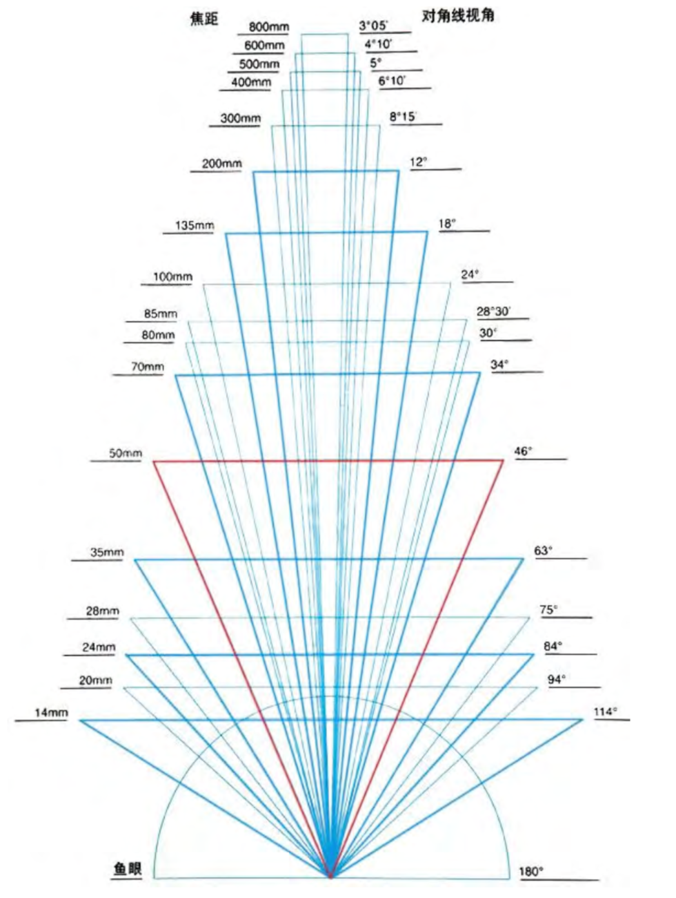

# 摄影笔记

## 相机的参数

### 画幅

### 镜头

#### 镜头种类

EF:EOS相机卡扣
EF-S:佳能APS-C画幅EOS相机
MP-E:放大率1倍以上的畏微距摄影镜头
TS-E:移轴镜头

#### 焦距

> 焦距是镜头中心点到感光器平面的距离

焦距越短(数字越小):拍摄的画面所容纳的范围越广
焦距越长(数字越大):拍摄画面所容纳的范围约窄

70-200mm: 广角70mm 长焦200mm
只有一个数值:定焦镜头

##### 视角

焦距越短，画面的范围越广。焦距越长，画面的范围越窄

焦距一般可分为广角、中焦和摄远镜头。 按照 135 相机全画幅视角:
24mm 以下的焦距可称之为超广角。
24-28mm 的焦距为标准广角。
28-35mm 的焦距为一般广角。
35-70mm 的焦距为中焦。
70-135mm 的焦距为中长焦。
135-400mm 的焦距为摄远，也叫长焦。
400mm 以上的焦距为超长焦。
50mm 因为视角与人眼一致，所以 50mm 的定焦镜头就是标准镜头，简称标头。

##### 透视

**画面中拍摄的对象会产生的近大远小的视觉效果** 叫做透视
焦距越短，近大远小的视觉效果约明显

#### 最大光圈

光圈是显示镜头明亮程度的参数

> 光圈值 F=焦距/孔径

焦距不变，孔径越大，光圈值越小，镜头越明亮。
孔径不变，焦距越短，光圈值越小， 镜头越明亮。

光圈往往代表了孔径的大小。

光圈越大，光圈值越小。但是问到光圈是多少，一般就是问光圈值是多少。简单地说就 是用作光圈值时，F2.8 要大于 F8。

f/2.8 最大光圈2.8。 有的镜头会两个数值，分别是广角端和长焦端
光圈越大，光圈值越小。F2.8 > F8

##### 景深

1、 光圈与景深的关系。光圈越大景深越浅。
2、 焦距与景深的关系。焦距越长景深越浅
3、 拍摄距离与景深的关系。拍摄距离越近，景深越浅。(拍摄距离就是相机到被摄体的距离)

#### 特性

L:佳能专业级
IS:防抖
USM:超声波马达
