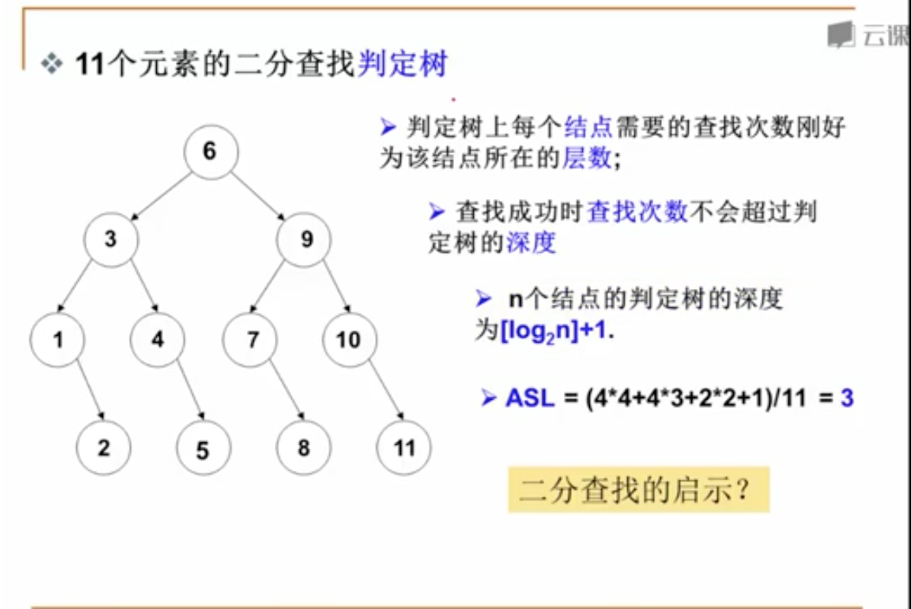
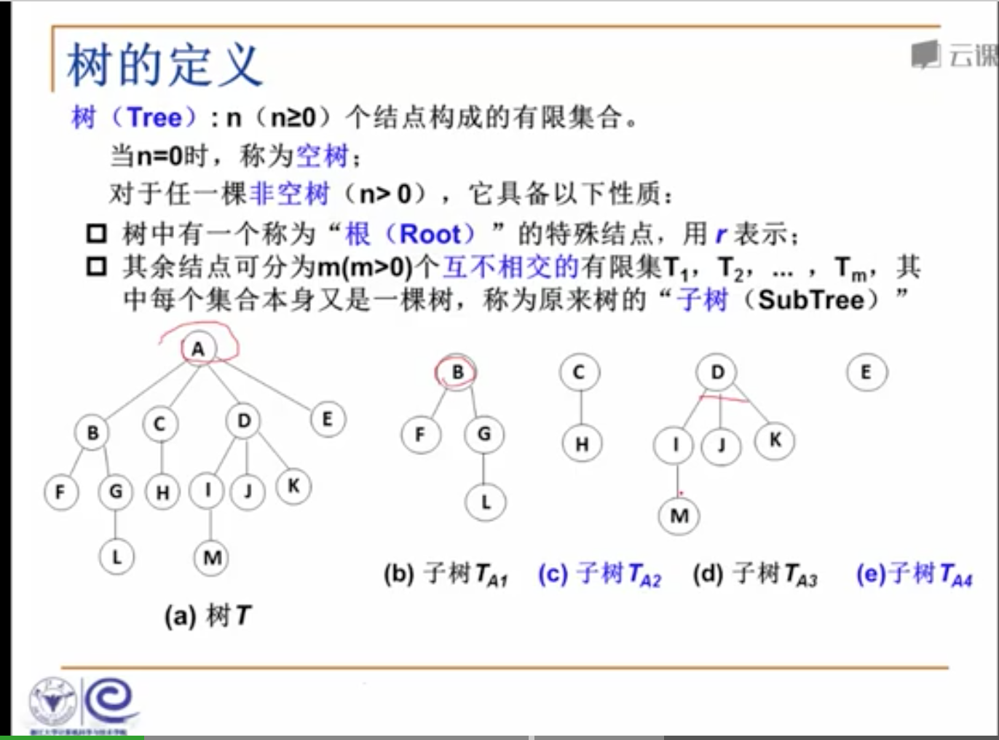
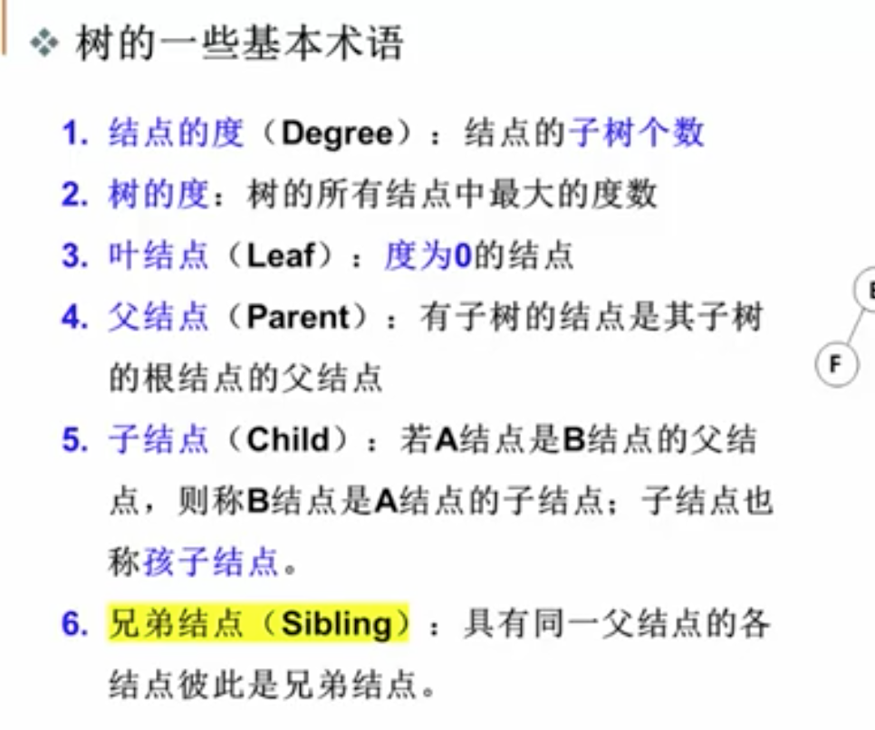
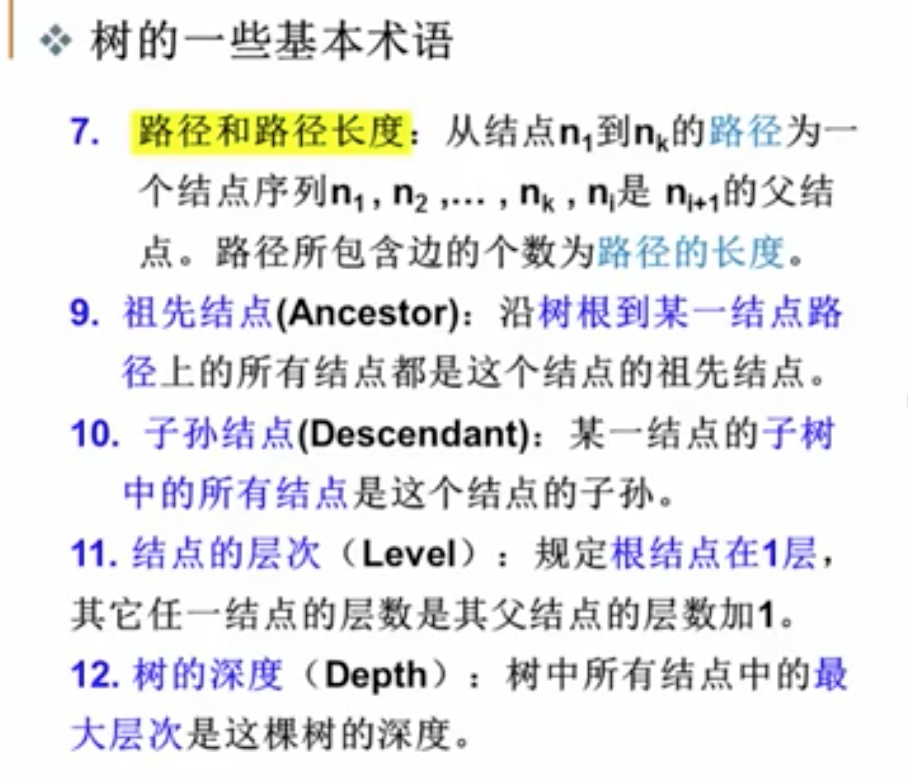

# 树

## 3.1

### 二分法查找判定树

  
### 树的定义

### 树与非树

1. 子树是不相交的
2. 除了根结点外，每个结点有且仅有一个父结点
3. 一棵N个结点的树有N-1条边

### 树的基本术语

## 3.2

### 特殊二叉树

1. 斜二叉树（Skewed Binary Tree）
2. 完美二叉树(Perfect Binary Tree,Full BinaryTree)
3. 完全二叉树(complete Binary Tree)

### 二叉树的几个重要性质

1. 一个二叉树第i层的最大结点数为 2^(i-1), i>=1
2. 深度为k的二叉树最大结点数为：2^k - 1, k >= 1
3. 对任何非空二叉树T，若n0表示叶结点的个数，n2是度为2的非叶结点个数，那么两者满足n0 = n2 + 1

## 4.1 二叉搜索出（binary search Tree）

### 特点

1. 非空左子树的所有键值小于根结点的键值
2. 非空右子树的所有键值大于根结点的键值
3. 左右子树都是搜索二叉树

## 4.2 二叉平衡树（balanced Binary Tree）AVL树

平衡因子(Banlance Factor 简称BF)：BF = h(L) - h(R)

空树或任意结点左右子树高度差的绝对值不超过1

n(h)高度为h的平衡二叉树的最少结点:n(h) = n(h-1) + n(h-2) + 1

给定结点数为n的AVL树最大高度为 $\log_2 n$

## 堆

结构性:用数组表示的完全二叉树
有序性:任意结点的关键字是其子树所有结点的最大值（或最小值）
最大堆（MaxHeap）也称大顶堆
最小堆（MinHeap）也称小顶堆

## 哈夫曼树

### 定义

带权路径长度(WPL):设定二叉树有n哥叶子结点，每个叶子结点带有权值$W_k$,
从根结点到每个叶子结点的长度为$l_k$，则每个叶子结点的带权路径长度之和就是$WPL=\sum_{k=1}^n{W_kL_k}$