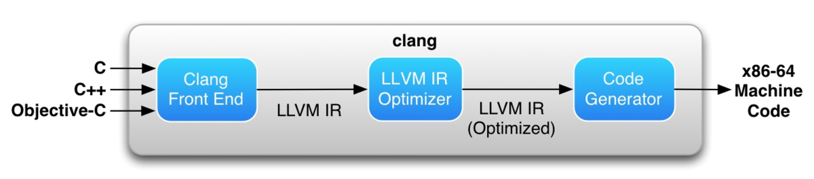
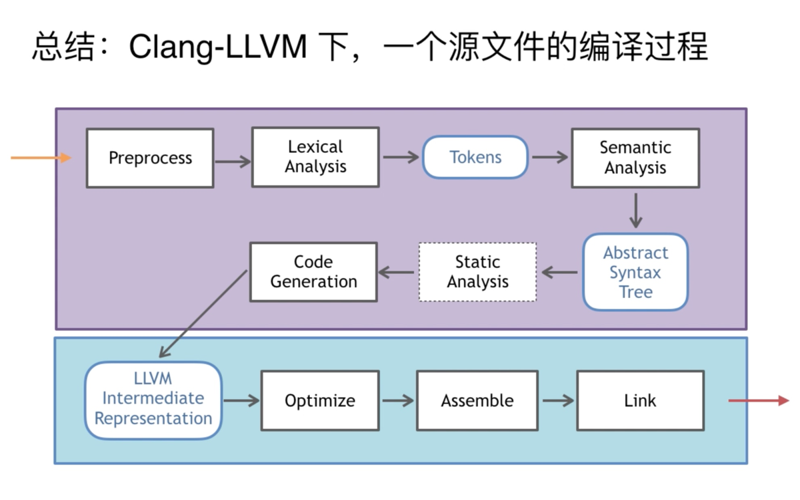

# 编译工具

## 工具

- LLVM - Low Level Virtual Machine 是众多编译工具及低级工具技术的统称,LLVM下的所有项目，包含LLVM中介码（LLVM IR）、LLVM除错工具、LLVM C++标准库等。
- Clang  - a C language family frontend for LLVM 是一个C、C++、Objective-C和Objective-C++编程语言的编译器前端。它采用了底层虚拟机（LLVM）作为其后端

## 编译过程
iOS的编译过程

Clang-LLVM下，编译过程

## Debugger

- GDB: UNIX及UNIX-like下的调试工具。
- LLDB:LLDB是个开源的内置于XCode的具有REPL(read-eval-print-loop)特征的Debugger，其可以安装C++或者Python插件。

https://segmentfault.com/a/1190000023617165
