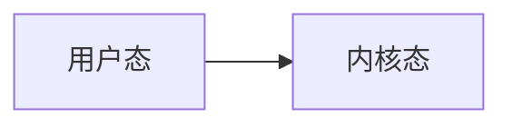
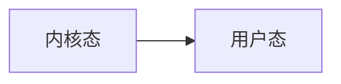
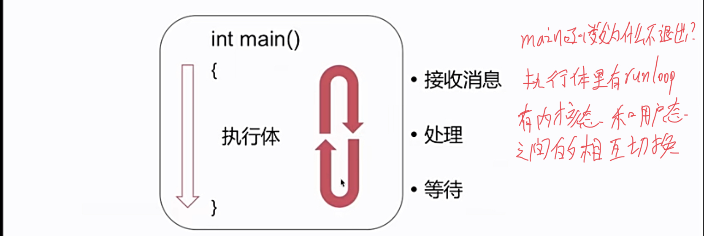
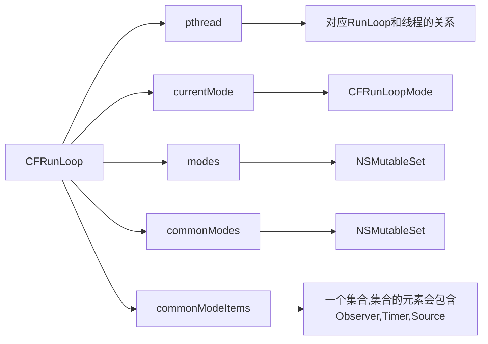
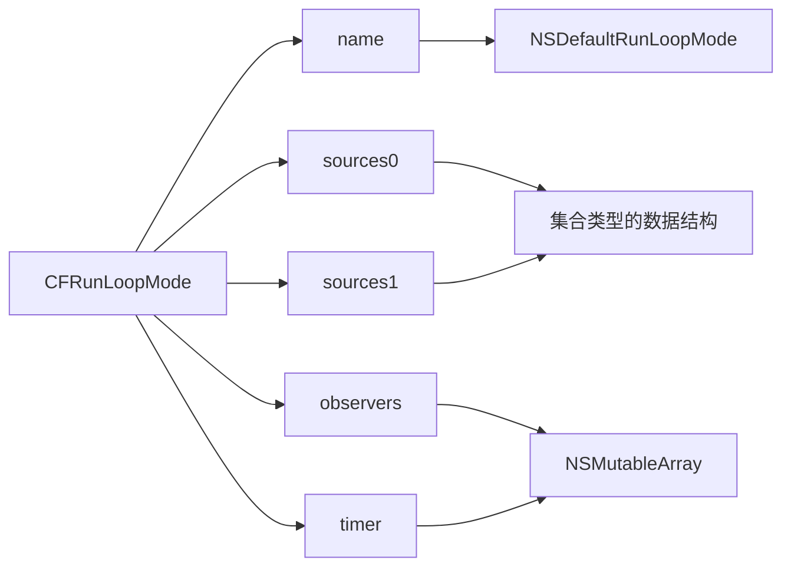
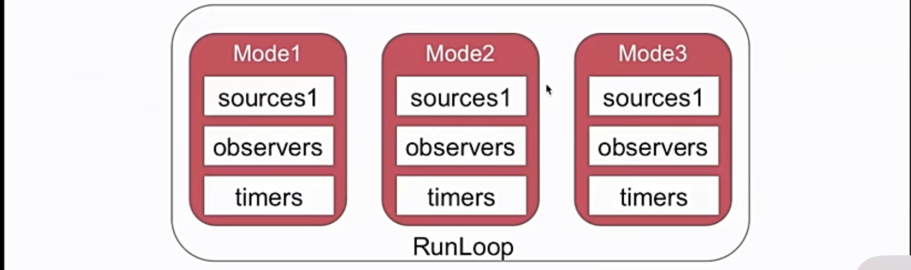
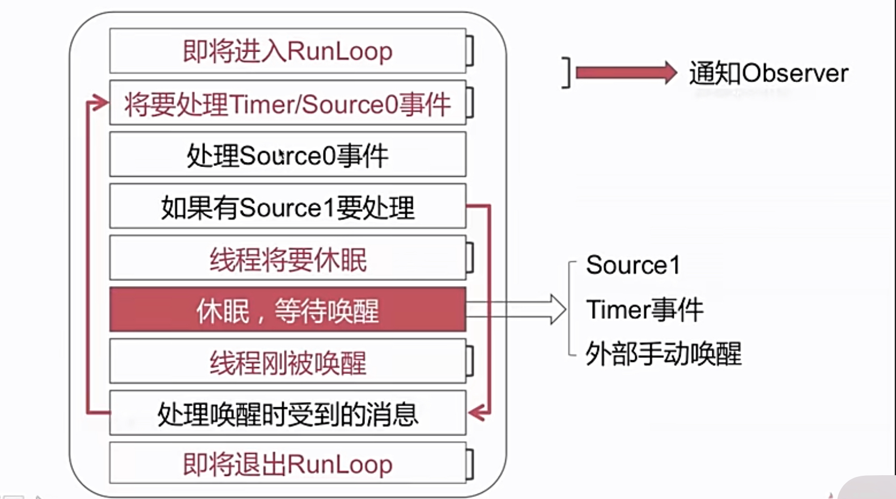
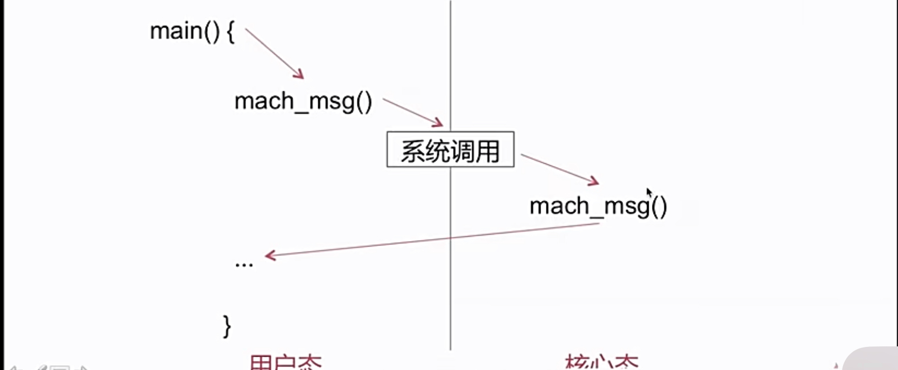

# Runloop

- 概念
- 数据结构
- 事件循环机制
- RunLoop与NSTimer
- RunLoop与多线程 

## 什么是RunLoop

RunLoop是通过内部维护的事件循环来对事件/消息进行管理的一个对象

事件循环

    - 没有消息需要处理时，休眠以避免资源占用
    - 有消息需要处理时，立刻被唤醒

没有消息需要处理时，休眠以避免资源被占用



有消息需要处理时，立刻被唤醒



main 函数为什么能保持不退出



等待 不等于 死循环

## 数据结构

NSRunloop是CFRunLoop的封装，提供了面形对象的API

CFRunLoop的数据结构

- CFRunLoop
- CFRunLoopMode
- Source/Timer/Observer





CFRunLoopSource

- sources0
需要手动唤醒线程
- sources1
具备唤醒线程的能力

CFRunLoopTimer

基于事件的定时器
和NSTimer 是 toll-free bridged的

CFRunLoopObserver

观测时间点

    - kCFRunLoopEntry （RunLoop的入口）
    - kCFRunLoopBeforeTimers
    - kCFRunLoopBeforeSources(将要处理一些sources事件)
    - kCFRunLoopBeforeWaiting （通知观察者将要进入休眠状态）
    - kCFRunLoopAfterWaiting （内核态到用户态切换后）
    - kCFRunLoopExit (退出)

 各个数据结构之间的关系

一个 RunLoop 对应多个 Model
一个 Model 对应多个 Source，Timer，Observer

RunLoop的Mode



Runloop 运行在 Mode1上时，Mode2的事件将无法响应，只能接受处理Mode1的回掉事件

### 如何将一个Timer添加到两个Mode上？

 commonMode的特殊性
 NSRunLoopCommonModes

    - CommonMode不是实际存在的一种Mode
    - 是同步Source/Timer/Observer到多个Mode中的一种技术方案

## 事件循环的实现机制

```Objective-C
void CFRunLoopRun()
```





## RunLoop与NSTimer

滑动TableView的时候我们的定时器还会生效吗？

当前线程正常情况下在kCFRunLoopDefaultMode上 当滑动TableView时 会切换到 UITrackingRunLoopMode上。
定时器一般添加在kCFRunLoopDefaultMode上，当切换到UITrackingRunLoopMode时候，定时器就不会在生效了。

如何让NSTimer继续生效
可以通过`void CFRunLoopAddTimer(runLoop,timer,commonMode)`函数添加到多个mode

## RunLoop与多线程

线程和Runloop是一一对应的
自己创建的线程默认是没有创建RunLoop的

怎样实现一个常驻线程

    1. 为当前线程开启一个RunLoop
    2. 向该RunLoop中添加一个Port/Source等维持RunLoop的事件循环
    3. 启动该RunLoop

```Objective-C
+ (void)runRequest{
    CFRunLoopSourceContext context = {0,NULL,NULL,NULL,NULL,NULL,NULL,NULL,NULL,NULL}
    CFRunLoopSourceRef source = CFRunLoopSourceCreate(kCFAllocatorDefault,0,&context);
    CFRunLoopAddSource(CFRunLoopGetCurrent(),source,kCFRunLoopDefaultMode);
    while(runAlways){
        @autoreleasepool{
            CFRunLoopRunInMode(kCFRunLoopDefaultMode,1.0e10,true)
        }
    }
    CFRunLoopRemoveSource(CFRunLoopGetCurrent,source,kCFRunLoopDefaultMode);
    CFRelease(source)
}

```