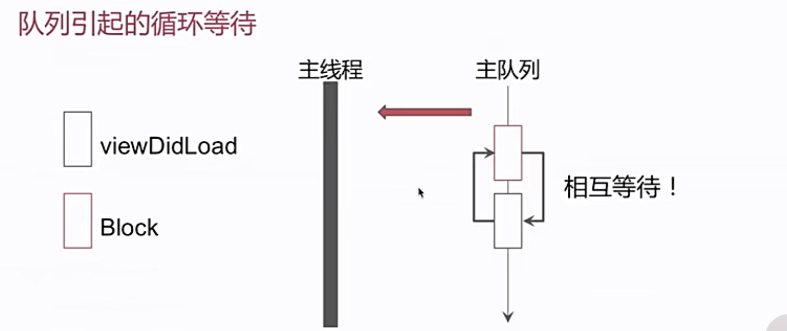
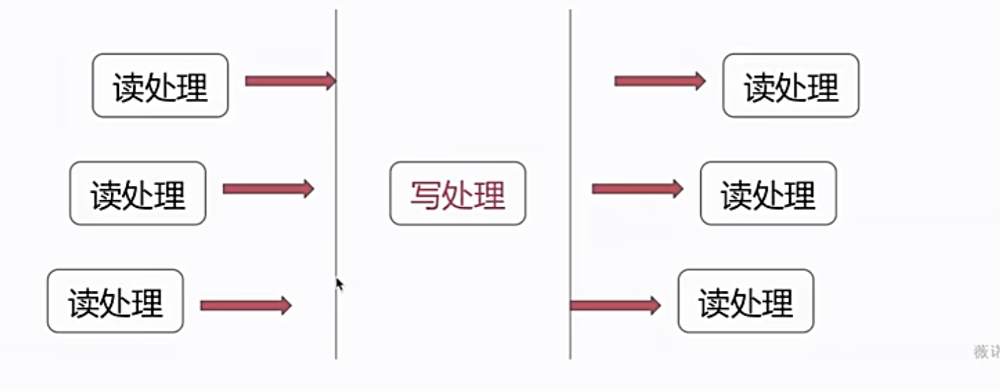

# Thread

- GFD
- NSOperation
- NSThread
- 多线程与锁

## GCD

- 同步/异步 串行并发
- dispatch_barrier_async (多读单写)
- dispatch_group

### 同步/异步 串行并发

- `dispatch_sync(serial_queue,^{//任务})`
- `dispatch_async(serial_queue,^{//任务})`
- `dispatch_sync(concurrent_queue,^{//任务})`
- `dispatch_async(concurrent_queue,^{//任务})`

### 同步串行

```Objective-C
-(void)viewDidLoad{
    dispatch_sync(dispatch_get_main_queue(),^{
        [self doSomething];
    })
}
```

队列引起的循环等待，产生死锁



主队列里提交的任务，不论同步异步提交，都在主线程执行

```Objective-C
-(void)viewDidLoad{
    dispatch_sync(serialQueue,^{
        [self doSomething];
    })
}
```


### 同步并发

```Objective-C
-(void)viewDidLoad{
NSLog(@"1")
dispatch_sync(global_queue,^{
    NSLog(@"2")
    dispatch_sync(global_queue,^{
        NSLog(@"3")
    })
    NSLog(@"4")
})
NSLog(@"5")
}
```

全局队列是并发队列
同步提交的任务，无论是串行并发，都是在当前线程执行
执行顺序12345

### 异步并发

```Objective-C
-(void)viewDidLoad{
    dispatch_async(global_queue,^{
        NSLog(@"1")
        [self performSelector:@selector(printLog) withObject:nil afterDelay:0];
        NSLog(@"3")
    })
}

-(void)printLog{
    NSLog(@"2");
}
```

打印13，2不会打印

GCD底层没有创建runloop ，perforSelector调用必须所属线程要有runloop

### dispatch_barrier_async 多读单写

读者，读者并发
读者，写者互斥
写者，写者互斥



```Objective-C
@interface UserCenter(){
    //定一个并发队列
    dispatch_queue_t concurrent_queue
    // 用户数据中心，可能多个线程需要数据访问
    NSMutableDictionary *userCenterDic;
}

@implementation UserCenter
-(id)init{
    self = [super init];
    if (self){
        concurrent_queue = dispatch_queue_create(@"read_write_queue",DISPATCH_QUEUE_CONCURRENT);
        userCenterDic = [NSNutableDictionary dictionary];
    }
    return self;

}

-(id)objectForKey:(NSString *)key{
    __block id obj;
    //同步读取指定数据  同步并发 ： 不论那个线程，都可以立刻得到结果
    dispatch_sync(concurrent_queue,^{
        obj = [userCenterDic objectForKey:key]
    })
    return obj;
}

-(void)setObject:(id)obj forKey:(NSString *)key{
    //异步栏栅调用设置数据
    dispatch_barrier_async(concurrent_queue,^{
        [userCenterDic setObject:obj forKey:key];
    })
}
```

dispatch_group_async()

使用GCD实现需求：ABC三个任务并发，完成后执行任务D

```Objective-C
@interface GroupObject()
@interface  GroupObject()
{
    dispatch_queue_t concurrent_queue;
    NSMutableArray <NSURL *> *arrayURLs;
}
@end

@implementation GroupObject

-(id)init{
    self = [super init];
    if(self) {
        concurrent_queue = dispatch_queue_create("concurrent_queue",DISPATCH_QUEUE_CONCURRENT);
        arrayURLs = [NSMutableArray array];
    }
}

-(void)handle{
    dispatch_group_t group = dispatch_group_create();
    for(NSURL *url in arrayURLs){
        dispatch_group_async(group,concurrent_queue,^{
            // 根据url去下载图片
            NSLog(@"url is %@",url);
        })
    }
    dispatch_group_notify(group,dispatch_get_main_queue(),^{
        //当添加到组中的所有任务执行完成后会调用该block
    })
}

@end

```

## NSOperation


需要和NSOperationQueue配合使用来实现多线程方案

- 添加任务依赖
- 添加任务状执行态控制
- 最大并发量

### 任务状态控制

- isReady
- isExcuting
- isFinished
- isisCancelled

如果只重写main方法，底层控制变更任务执行完成状态，以及任务退出。
如果重写start方法，自行控制任务状态。

系统是怎样移除一个isFinshed =  YES 的 NSOperation 的?

通过 KVO

## NSThread

启动流程

start() ->  创建pthread -> main() -> [target performSelector:selector] -> exit()

如果要添加常驻线程，可以在selector里添加runloop 实现常驻

## 锁

iOS中有那些锁

- @synchronized
- atomic
- OSSpinLock
- NSRecursiveLock
- NSLock
- dispatch_semaphore_t

@synchronized 创建单例对象

atomic 
 修饰属性的关键则
 对被修饰对象进行原子操作（不负责使用）

 ```Objective-C
 @property (atomic) NSMutableArray *array;

 self.array = [NSMutableArray array]; 保证线程安全
 [self.array addObject:obj] 使用不保证线程安全
 ```

### OSSpinLock

自旋锁 循环等待询问，不释放当前资源

用于轻量级的数据访问，简单的int值 +1，-1操作

### NSLock

解决细粒度的线程问题

 ```Objective-C

 -(void)methodA{
     [lock lock]
     [self methodB]
     [lock unlock]
 }

 -(void)methidB{
     [lock lock]
     //操作逻辑
     [lock unlock]
 }

 ```

 以上代码导致死锁

 可以使用地柜锁解决  NSRecursiveLock 解决

  ```Objective-C

   -(void)methodA{
     [RecursiveLock lock]
     [self methodB]
     [RecursiveLock unlock]
 }

 -(void)methidB{
     [RecursiveLock lock]
     //操作逻辑
     [RecursiveLock unlock]
 }
   ```

   不会产生死锁

### dispatch_semaphore_t

信号量

`dispatch_semaphore_create(1)`
`dispatch_semaphore_wait(semaphore,DISPATCH_TIME_FOREVER)`
`dispatch_semaphore_signal(semaphore)`