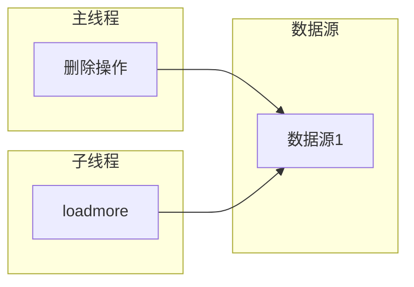
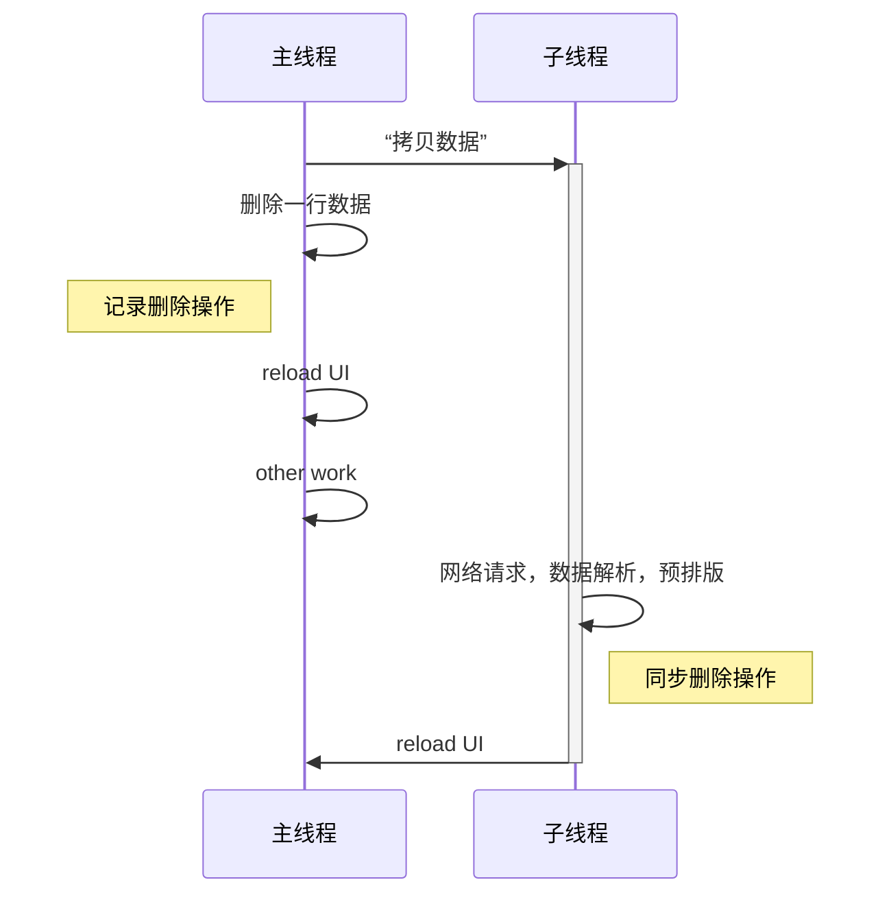
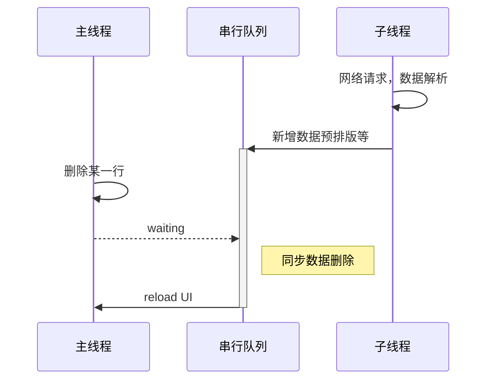
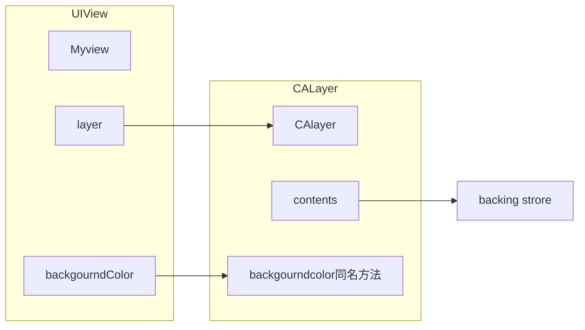
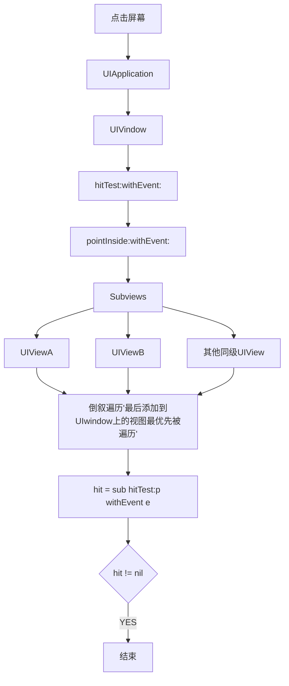
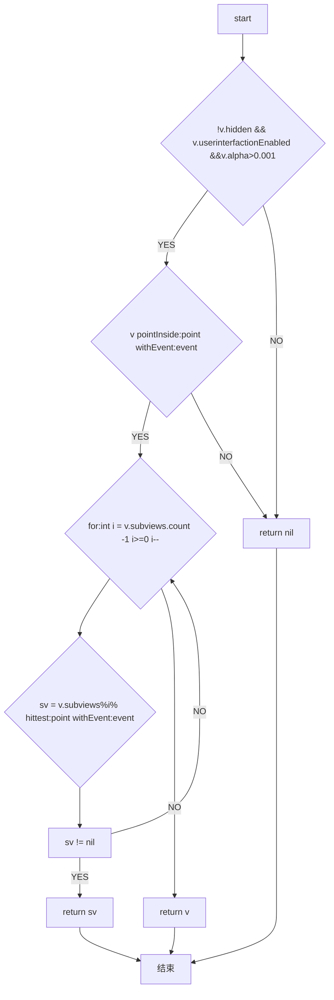

# UI

- UITableView
- 事件传递&视图响应
- 图像显示原理
- 卡顿&原因
- 绘制原理&异步绘制
- 离屏渲染

## UITableView相关

- 重用机制
- 数据源同步

### 重用机制

```Objcetive-C
//实现重用机制的类
@interface ViewReusePool : NSObject

//从重用池当中取出一个可重用的view
-(UIView *)dequeueReuseableView;

//向重用池当中添加一个视图
-(void)addUsingView:(UIView *)view;

//设置方法，将当前使用中的视图移动到可重用队列当中
-(void)reset;
@end
```

```Objcetive-C
@interface ViewReusePool()

//等待重用的队列
@property (nonatomic,strong)NSMutableSet *waitUsedQueue;

//使用中的队列
@property (nonatomic,strong)NSMutableSet *usingQueue;
@end

@implementation ViewReusePool

-(id)init{
    self = [super init];
    if(self){
        _waitUsedQueue = [NSMutableSet set];
        _usingQueue = [NSMutableSet set];
    }
}

- (UIView *)dequeueReusableView{
    UIView *view = [_waitUsedQueue anyObject];
    if(UIview == nil){
        return nil;
    }
    else{
        //进行队列移动
        [_waitUsedQueue removeObject:view];
        [_usingQueue addObject:view];
        return view;
    }
}

-(void)addUsingView:(UIView *)view{
    if(view == nil){
        return;
    }
    [_usingQueue addObject:view];
}

-(void)reset{
    UIView *view = nil; 
    while((view = [_usingQueue anyObject])){
        [_usingQueue removeObject:view];
        [_waitUsedQueue addObject:view];
    }
}
```

### 数据源同步的问题



多线程对共享数据的一个访问

#### 并发访问，数据拷贝



需要数据同步操作，和数据拷贝使用内存大

#### 串行访问



子线程任务很耗时，删除动作会有延时

## UIView和CAlayer



backing store 实际上是位图

- UIView为其提供内容，以及负责处理触摸等事件，参与响应链
- Calayer 负责显示内容contents

 体现了单一职责原则

## 事件传递&视图响应链


点击了C2位置

```Objcetive-C
//最终那个视图响应，返回那个视图
-(void)hitTest:(CGPoint)point withEvent:(UIEvent *)event;
//是否在当前视图内 ， 是YES
-(Bool)pointInside(CGPoint)point withEvent:(UIEvent *)event;
```

### 时间传递流程



### -(void)hitTest:(CGPoint)point withEvent:(UIEvent *)event 内部实现




