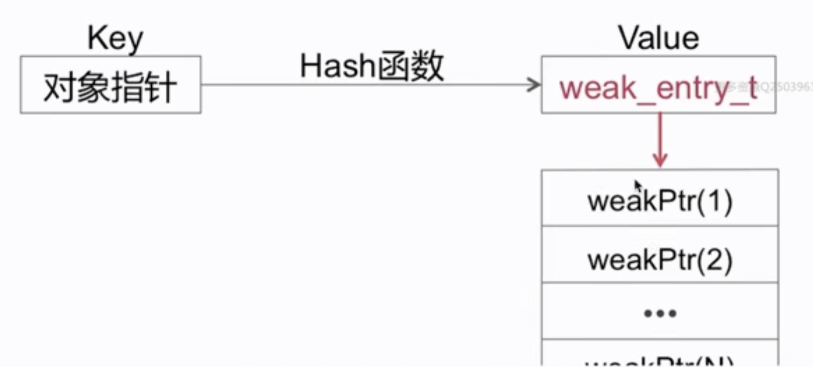
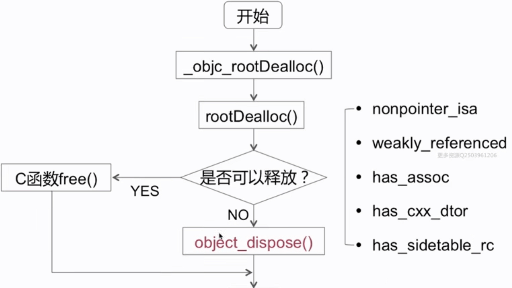
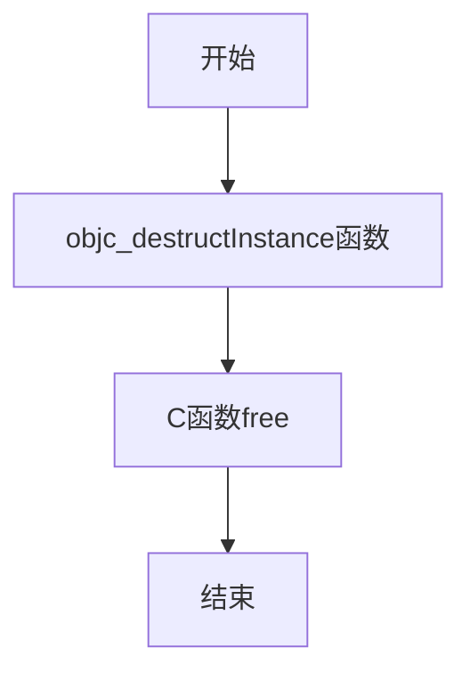
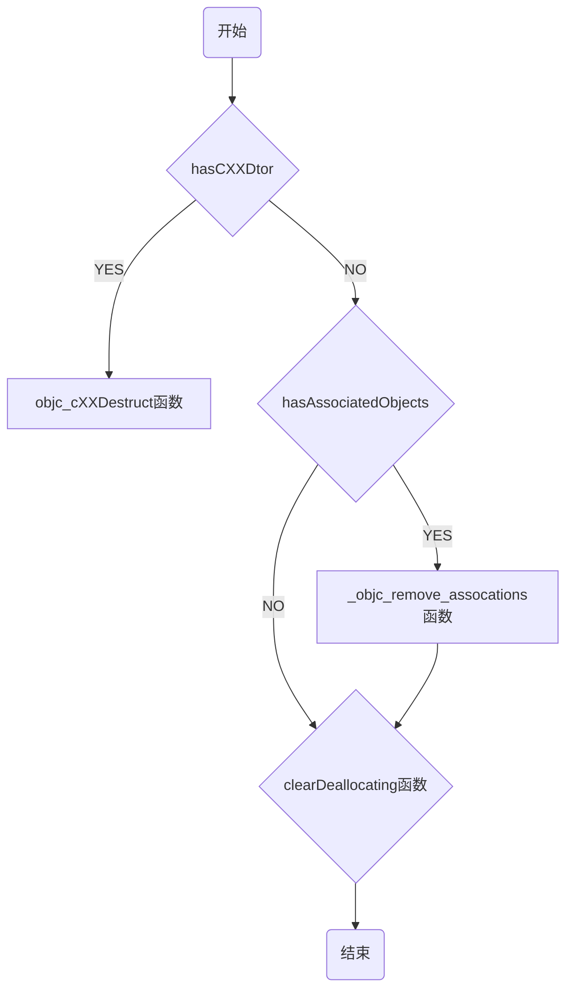
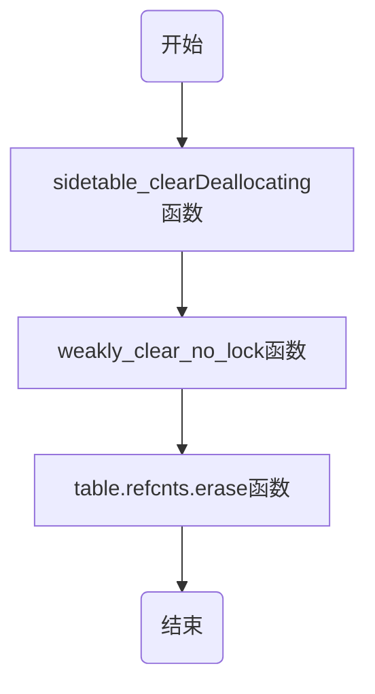

# 内存管理

- 内存布局
- 内存管理方案
- 数据结构
- ARC & MRC
- 引用计数
- 弱引用
- 自动释放池
- 循环引用

## 内存布局


栈区向下增长，堆区向上增长

- stack:方法调用
- heap:通过alloc等分配的对象
- bss:未初始化的全局变量等
- data:以初始化的全局变量等
- text:程序代码

## 内存管理方案

- TaggedPointer:对一些小对象如(NSNumber)
- NONPOINTER_ISA:在64位架构下
- 散列表:引用计数表，弱引用表

> objc-runtime-680版本讲解

### TaggedPointer

- Tagged Pointer专门用来存储小的对象，例如NSNumber和NSDate
- Tagged Pointer指针的值不再是地址了，而是真正的值。所以，实际上它不再是一个对象了，它只是一个披着对象皮的普通变量而已。所以，它的内存并不存储在堆中，也不需要 malloc 和 free。
- 在内存读取上有着 3 倍的效率，创建时比以前快 106 倍。

[Tagged Pointer的实现细节](https://blog.devtang.com/2014/05/30/understand-tagged-pointer/)

### NONPOINTER_ISA

#### arm64架构下,64个比特位的存储信息

0-15位

｜0｜0｜0｜0｜0｜0｜0｜0｜0｜0｜0｜0｜0｜0｜0｜0｜

｜shiftcls(3-15)｜has_cXX_dtor(2)｜has_assoc(1)｜indexed(0)｜

16 - 31位

｜0｜0｜0｜0｜0｜0｜0｜0｜0｜0｜0｜0｜0｜0｜0｜0｜

｜shiftcls(31-16)｜

32 - 47 位

｜0｜0｜0｜0｜0｜0｜0｜0｜0｜0｜0｜0｜0｜0｜0｜0｜

|extra_rc(45-47)|has_sidetable_rc(44)|deallocating(43)|weakly_referenced(42)|magic(36-41)|shiftcls(32-35)|

63 - 48

｜0｜0｜0｜0｜0｜0｜0｜0｜0｜0｜0｜0｜0｜0｜0｜0｜

|extra_rc(64-48)|

- indexed：如果是0 代表是一个纯的is指针，里面的内容是类的地址; 如果是1 不仅是类对象的地址，而且有内存管理方面的信息
- has_assoc: 是否有关联对象，0没有，1有
- has_cXX_dtor:当前对象是否有使用到c++的一些东西,在ARC下也可以表示使用ARC管理的
- shiftcls : 类对象的指针地址
- weakly_referenced:标记当前是否有弱引用指针
- deallocating:是否正在进行deallocate 操作
- has_sidetable_rc:如果当前的引用计数存储达到上限，需要外挂一个sidetable的数据结构去存储相关的引用计数
- extra_rc:额外的引用计数

#### SideTables()结构


#### SideTable结构（散列表）


#### 为什么不是一个SideTable

如果所有引用计数都在一个表中，那么多个对象在不同线程中操作该表，操作过程中加锁，造成排队操作现象；
而如果拆成多个表引入分离锁，那么就减小了这种排队的可能，提升了访问效率

#### 怎样实现快速分流

SideTable的本质是一张Hash表

#### Sninlock_t

- Spinlock_t 是“忙等”的锁。
- 适用于轻量访问。如 +1，-1的操作

#### 引用计数表

RefcountMap是一个Hash表

使用hash查找获得引用计数的值
ptr->(DisguisedPtr(objc_object)->size_t(引用计数的值)

引用计数是用hash表实现，为什么要用hash表，因为hash表的查找是O(1)

size_t (unsigned long)

|0|0|0|...|0|0|0|0|0|
|RC(62)|deallocating(1)|weakly_referenced(1)|

- 标记当前是否有弱引用指针
- deallocating:是否正在进行deallocate 操作
- RC 该对象的实际的引用计数值

在取引用计数值的时候要偏移两位

#### 弱引用表

weak_table_t 也是一张hash表



- weak_entry_t 结构体数组，存储实际的弱引用结构体指针

### MRC

手动引用计数

- alloc 分配一个内存空间
- retain +1
- release -1
- retainCount 获取当前引用计数值
- autorelease 当前对象在autorelease结束的时候 调用release操作
- dealloc 在调用dealloc时需要调用super dealloc 来释放父类的成员变量

### ARC

自动引用计数

ARC是LLVM和Runtime协作的结果

ARC中禁止手动调用 retain/release/retainCount/dealloc

ARC中新增weak，strong属性关键字

### 引用技术管理

实现原理分析

- alloc
- retain
- release
- retainCount
- dealloc

#### alloc

经过一系列调用，最终调用了C函数calloc。此时并没有设置引用计数为1.

#### retain

```C++
Sidetable& table = SideTables()[this];
size_t& refcntStorage = table.refcnts[this];
refcntStorage += SIDE_TABLE_RC_ONE;
//SIDE_TABLE_RC_ONE是一个宏，并不是+1 因为 size_t 中有两位偏移量
```

#### release实现

```C++
Sidetable& table = SideTables()[this];
RefcountMap::iterator it = table.refcnts.find(this);
it-second -= SIDE_TABLE_RC_ONE
//SIDE_TABLE_RC_ONE是一个宏，并不是-1 因为 size_t 中有两位偏移量
```

#### retainCoun实现

```C++
Sidetable& table = SideTables()[this];
size_t refcnt_result = 1;
RefcountMap::iterator it = table.refcnts.find(this);
refcnt_result += it->second >> SIDE_TABLE_RC_SHIFT;
```

#### dealloc实现



- nonpointer_isa 判断是否使用了非指针型的isa
- weakly_referenced 是否有weak指针指向他
- has_assoc 判断当前对象是否有关联对象
- has_cXX_dtor 判断当前对象内部实现是否涉及到C++ 以及是否使用ARC管理内存
- has_sidetable_rc 当前对象引用计数使用sidetable

#### object_dispose()实现



#### objc_destructInstance实现



### clearDeallocating函数



- weakly_clear_no_lock函数 将指向该对象的弱引用指针值为nil
- table.refcnts.erase函数 从引用计数表中擦除该对象引用计数