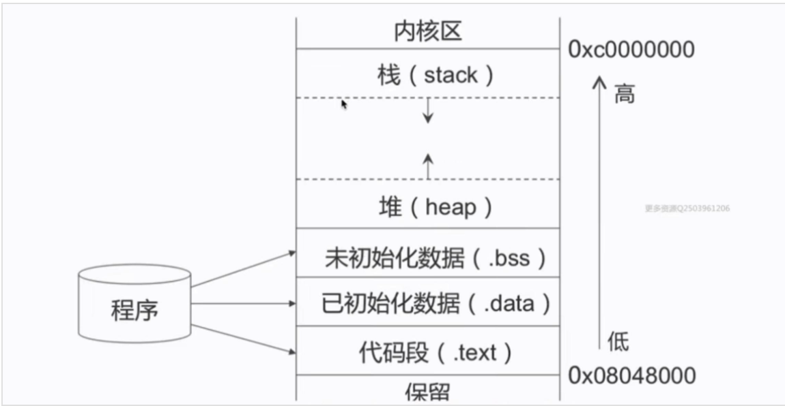
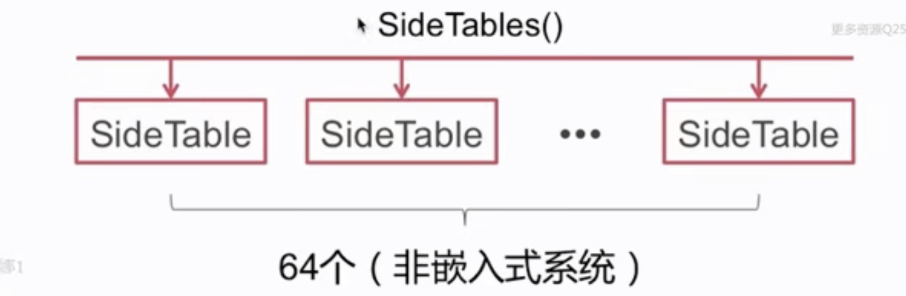
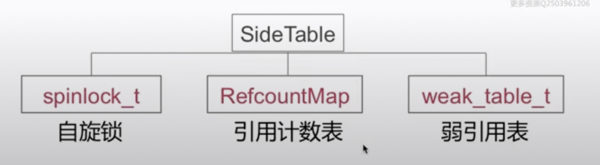

# 内存管理

- 内存布局
- 内存管理方案
- 数据结构
- ARC & MRC
- 引用计数
- 弱引用
- 自动释放池
- 循环引用

## 内存布局

栈区向下增长，堆区向上增长

- stack:方法调用
- heap:通过alloc等分配的对象
- bss:未初始化的全局变量等
- data:以初始化的全局变量等
- text:程序代码

## 内存管理方案

- TaggedPointer:对一些小对象如(NSNumber)
- NONPOINTER_ISA:在64位架构下
- 散列表:引用计数表，弱引用表

> objc-runtime-680版本讲解

### NONPOINTER_ISA 

#### arm64架构下,64个比特为的存储信息

0-15位

｜0｜0｜0｜0｜0｜0｜0｜0｜0｜0｜0｜0｜0｜0｜0｜0｜

｜shiftcls(3-15)｜has_cXX_dtor(2)｜has_assoc(1)｜indexed(0)｜

16 - 31位

｜0｜0｜0｜0｜0｜0｜0｜0｜0｜0｜0｜0｜0｜0｜0｜0｜

｜shiftcls(31-16)｜

32 - 47 位

｜0｜0｜0｜0｜0｜0｜0｜0｜0｜0｜0｜0｜0｜0｜0｜0｜

|extra_rc(45-47)|has_sidetable_rc(44)|deallocating(43)|weakly_referenced(42)|magic(36-41)|shiftcls(32-35)|

63 - 48

｜0｜0｜0｜0｜0｜0｜0｜0｜0｜0｜0｜0｜0｜0｜0｜0｜

|extra_rc(64-48)|

- indexed：如果是0 代表是一个纯的is指针，里面的内容是类的地址; 如果是1 不仅是类对象的地址，而且有内存管理方面的信息
- has_assoc: 是否有关联对象，0没有，1有
- has_cXX_dtor:当前对象是否有使用到c++的一些东西,在ARC下也可以表示使用ARC管理的
- shiftcls : 类对象的指针地址
- weakly_referenced:标记当前是否有弱引用指针
- deallocating:是否正在进行deallocate 操作
- has_sidetable_rc:如果当前的引用计数存储达到上限，需要外挂一个sidetable的数据结构去存储相关的引用计数
- extra_rc:额外的引用计数

#### SideTables()结构

#### SideTable结构（散列表）

#### 为什么不是一个SideTable

如果所有引用计数都在一个表中，那么多个对象在不同线程中操作该表，操作过程中加锁，造成排队操作现象；
而如果拆成多个表引入分离锁，那么就减小了这种排队的可能，提升了访问效率

#### 怎样实现快速分流

SideTable的本质是一张Hash表

#### Sninlock_t

- Spinlock_t 是“忙等”的锁。
- 适用于轻量访问。如 +1，-1的操作

#### 引用计数表

RefcountMap是一个Hash表

使用hash查找获得引用计数的值
ptr->(DisguisedPtr(objc_object)->size_t(引用计数的值)

引用计数是用hash表实现，为什么要用hash表，因为hash表的查找是O(1)

#### 引用技术表

size_t

|0|0|0|...|0|0|0|0|0|
|RC|deallocating|weakly_referenced|

- 标记当前是否有弱引用指针
- deallocating:是否正在进行deallocate 操作
- RC 该对象的实际的引用计数值

在取引用计数值的时候要偏移两位
