# UI

- UITableView
- 事件传递&视图响应
- 图像显示原理
- 卡顿&原因
- 绘制原理&异步绘制
- 离屏渲染

## UITableView相关

- 重用机制
- 数据源同步

### 重用机制

```Objcetive-C
//实现重用机制的类
@interface ViewReusePool : NSObject

//从重用池当中取出一个可重用的view
-(UIView *)dequeueReuseableView;

//向重用池当中添加一个视图
-(void)addUsingView:(UIView *)view;

//设置方法，将当前使用中的视图移动到可重用队列当中
-(void)reset;
@end
```

```Objcetive-C
@interface ViewReusePool()

//等待重用的队列
@property (nonatomic,strong)NSMutableSet *waitUsedQueue;

//使用中的队列
@property (nonatomic,strong)NSMutableSet *usingQueue;
@end

@implementation ViewReusePool

-(id)init{
    self = [super init];
    if(self){
        _waitUsedQueue = [NSMutableSet set];
        _usingQueue = [NSMutableSet set];
    }
}

- (UIView *)dequeueReusableView{
    UIView *view = [_waitUsedQueue anyObject];
    if(UIview == nil){
        return nil;
    }
    else{
        //进行队列移动
        [_waitUsedQueue removeObject:view];
        [_usingQueue addObject:view];
        return view;
    }
}

-(void)addUsingView:(UIView *)view{
    if(view == nil){
        return;
    }
    [_usingQueue addObject:view];
}

-(void)reset{
    UIView *view = nil; 
    while((view = [_usingQueue anyObject])){
        [_usingQueue removeObject:view];
        [_waitUsedQueue addObject:view];
    }
}
```

### 数据源同步的问题

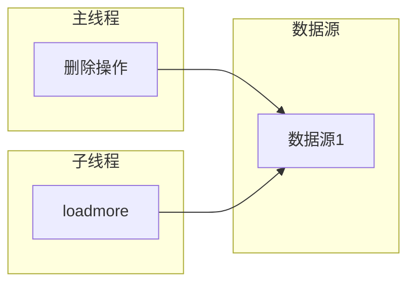

多线程对共享数据的一个访问

#### 并发访问，数据拷贝

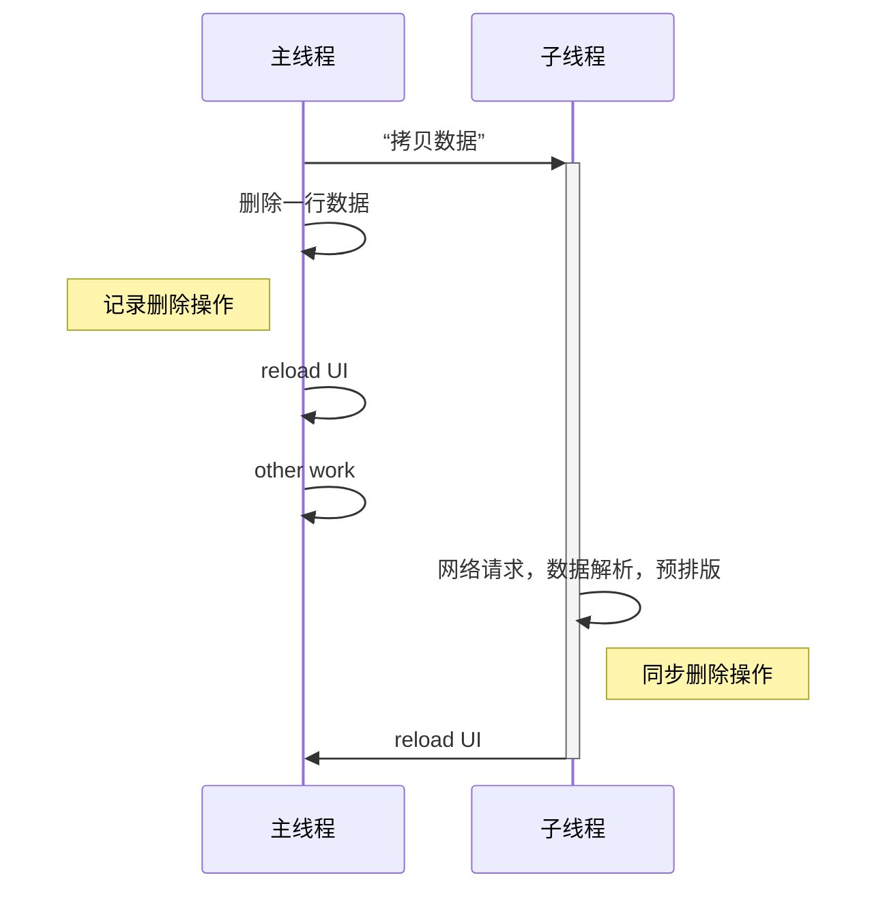

需要数据同步操作，和数据拷贝使用内存大

#### 串行访问

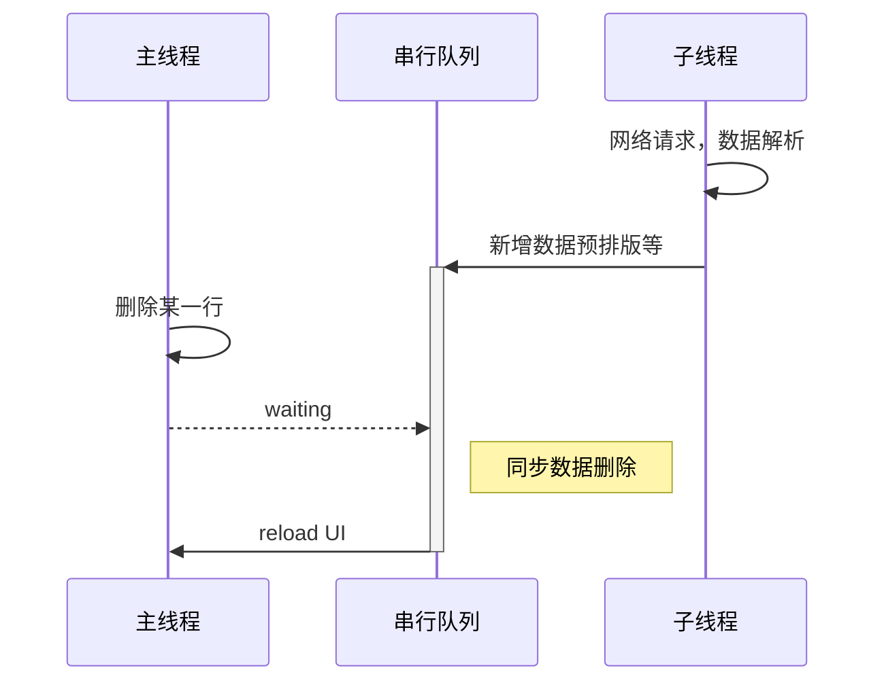

子线程任务很耗时，删除动作会有延时

## UIView和CAlayer

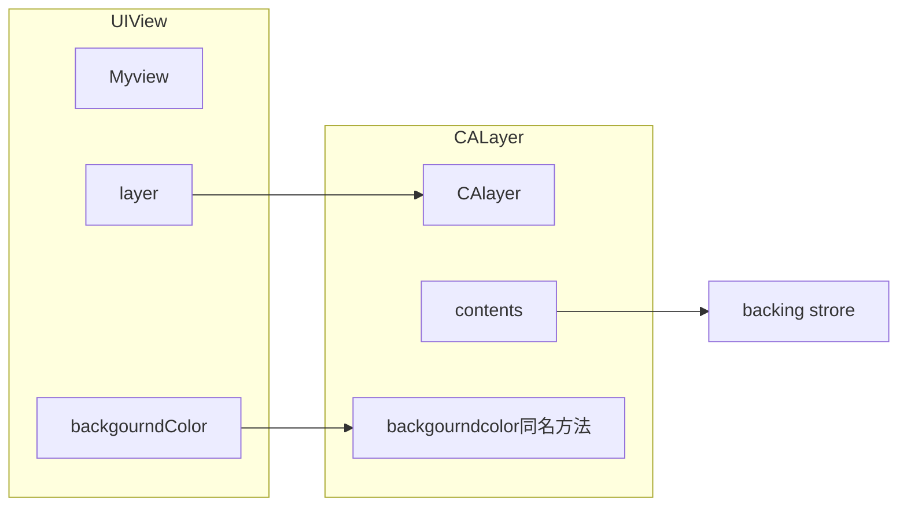

backing store 实际上是位图

- UIView为其提供内容，以及负责处理触摸等事件，参与响应链
- Calayer 负责显示内容contents

 体现了单一职责原则

## 事件传递&视图响应链

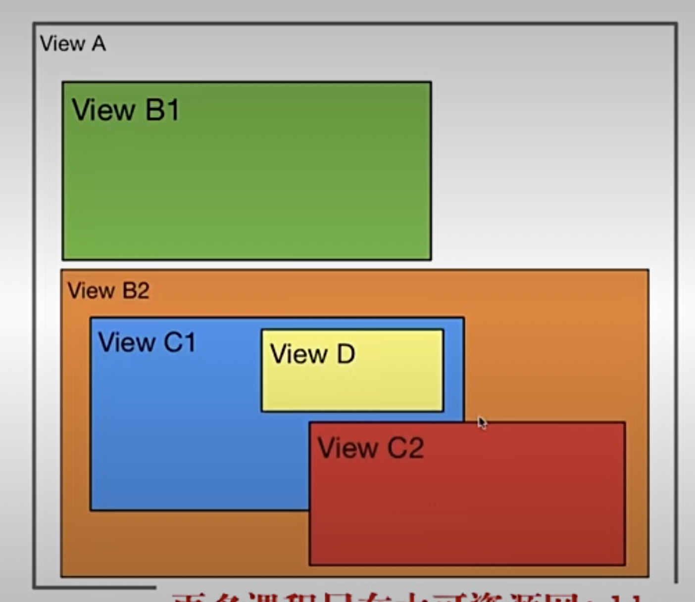

点击了C2位置

```Objcetive-C
//最终那个视图响应，返回那个视图
-(void)hitTest:(CGPoint)point withEvent:(UIEvent *)event;
//是否在当前视图内 ， 是YES
-(Bool)pointInside(CGPoint)point withEvent:(UIEvent *)event;
```

### 时间传递流程

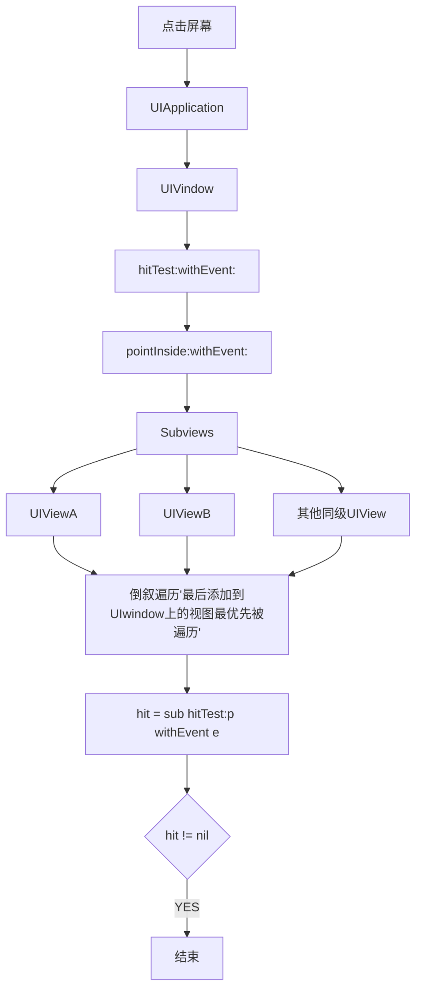

### -(void)hitTest:(CGPoint)point withEvent:(UIEvent *)event 内部实现

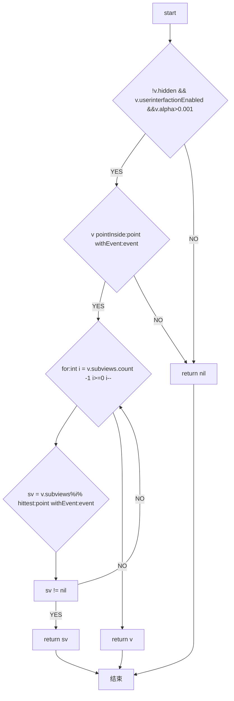

### 方形button圆的点击事件

```Objective-C

-(UIview *)hiteTest:(CGPoint)point withEvent:(UIEvent *)event{
    if(!self.userInteractionEnabled ||
        [self isHidden] ||
        self.alpha <= 0.01){
            return nil;
    }
    if([self pointInside:point withEvent:event]){
        //遍历当前对象子视图
        __block UIView *hit = nil;
        [self.subViews enumerateObjectsWithOptions:NSEnumerationReverse 
        usingBlock:^(__kindof UIView *_Nonnull obj,NSUinteger idx,BOOL *_Nonnull stop){
            //坐标转换
            CGPoint vonvertPoint = [self convertPoint:point toView:obj];
            //调用子视图的hittest方法
            hit = [obj hitTest:vonvertPoint withEvent:event];
            //如果找到了接受时间的对象 ，则停止遍历
            if(hit){
                *stop = YES
            }
        }];
        
    }
    
    if(hit){
        return hit;
    }
    else{
        return self;
    }

}

-(BOOL)pointInside:(CGPoint)point withEvent:(UIEvent *)event{
    CGFloat x1 = point.x;
    CGFloat y1 = point.y;

    CGFloat x2 = self.frame.size.width /2
    CGFloat y2 = self.frame.size.height / 2

    double dis = sqrt((x1 - x2) * (x1 - x2) + (y1 - y2) * (y1 - y2));
    
    //在以当前空间中心为圆新半径为当前控件宽度的圆内
    if(dis <= self.frame.size.width / 2>){
        return YES
    }
    else{
        return NO
    }
}
```

### 事件响应的流程

```Objcetive-C
-(void)touchesBegan:(NSSet *)touchs withEvent:(UIEvent *)event;
-(void)touchesMoved:(NSSet *)touchs withEvent:(UIEvent *)event;
-(void)touchesEnded:(NSSet *)touchs withEvent:(UIEvent *)event;
```

### 图像显示原理

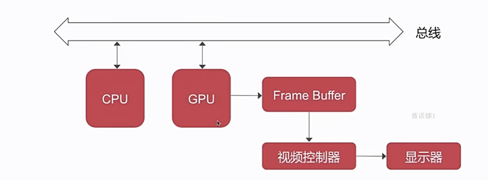

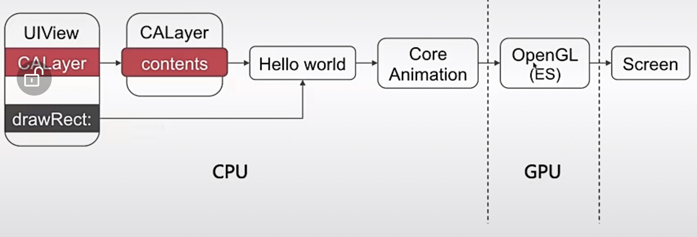

CPU工作

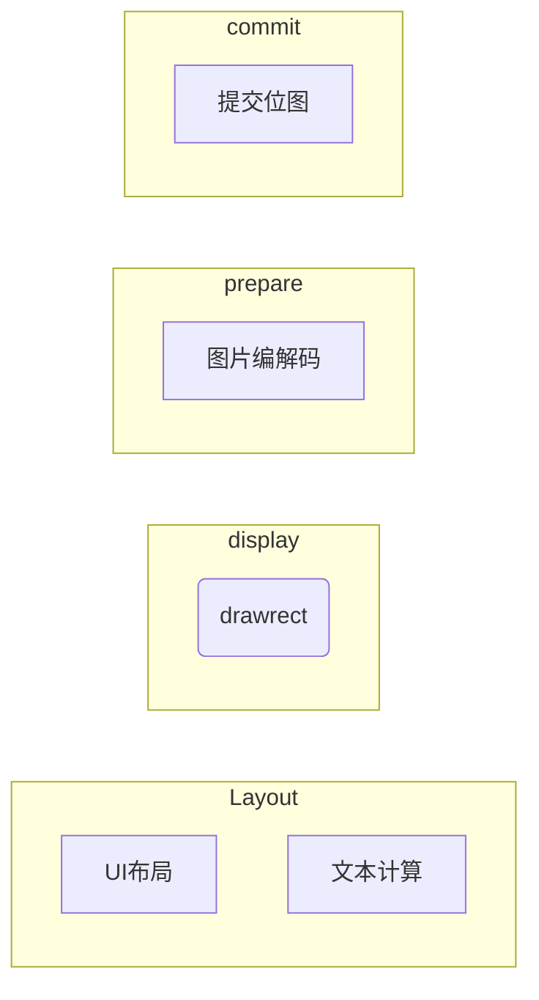

GPU渲染管线

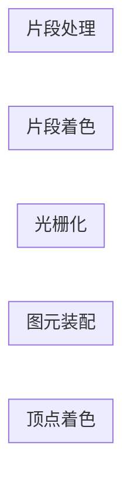

GPU渲染完提交FrameBuffer

### UI卡顿，掉帧的原因

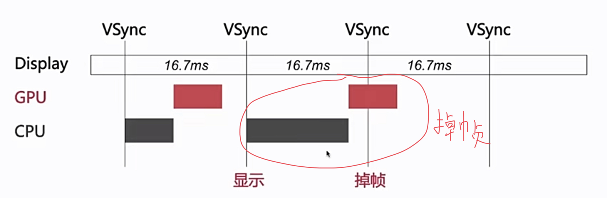

#### 优化方案

CPU工作
    - 对创建，调整，销毁放到子线程做
    - 预排版（布局计算，文本计算）放到子线程
    - 预渲染（文本等异步绘制，图片编码解码）

GPU优化
    - 纹理渲染 （避免离屏渲染）
    - 试图混合（减轻视图层级的复杂性）

UIView的绘制原理

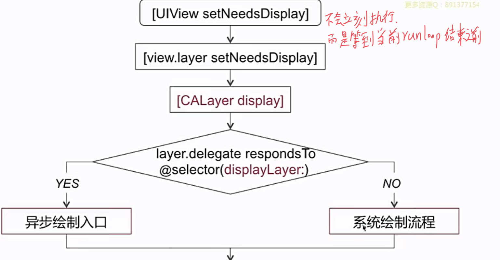

系统默认绘制流程


异步绘制

```Objective-C
- [layer.delegate displayLayer:]
```

    - 代理负责生成对应的bitmap
    - 设置bitmap作为layer.contents属性的值

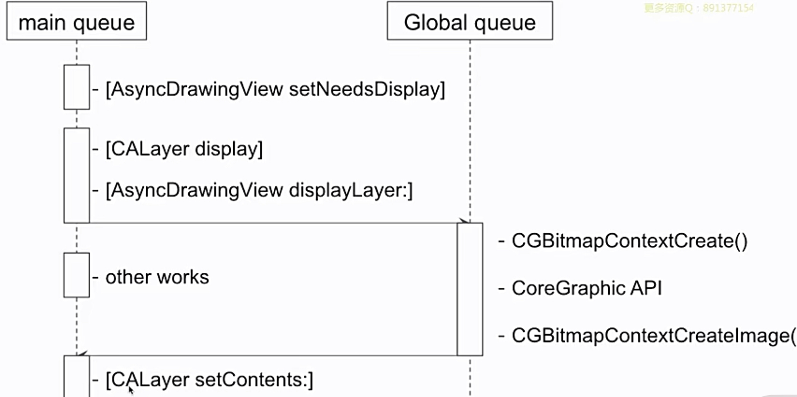

### 离屏渲染

- On-Screen Reddering
意为当前屏幕渲染，指的是GPU的渲染操作是在当前用于显示的屏幕缓冲区中进行

- Off-Screen Rending
意为离屏渲染，指的是GPU在当前屏幕缓冲区以外新开辟一个缓冲区进行渲染操作

#### 何时触发

- 圆角（当和maskToBounds一起使用时）
- 图层蒙版
- 阴影
- 光栅化

#### 为何要避免

触发离屏渲染会曾增加GPU的工作量，导致CPU和GPU工作超过16.7ms，导致掉帧

涉及到
    - 创建新的渲染缓冲区
    - 上下文切换
