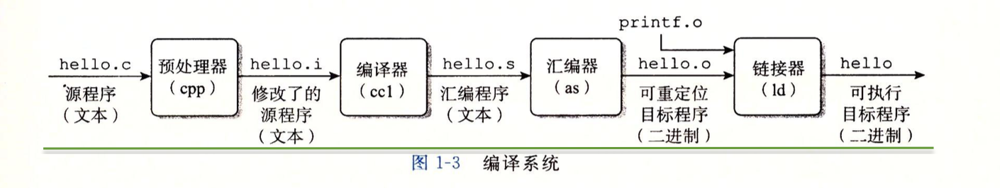
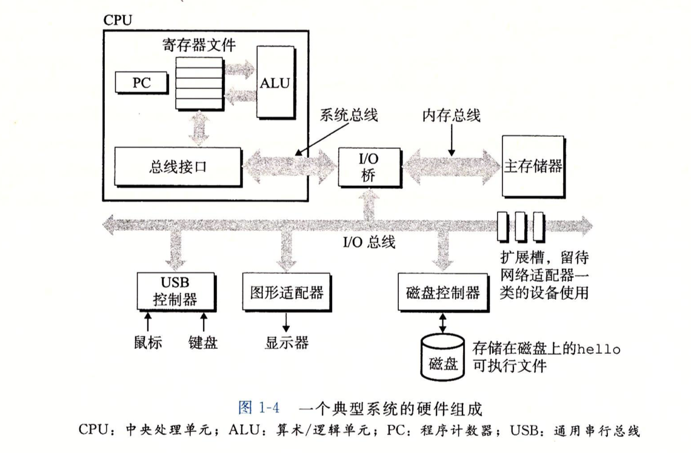
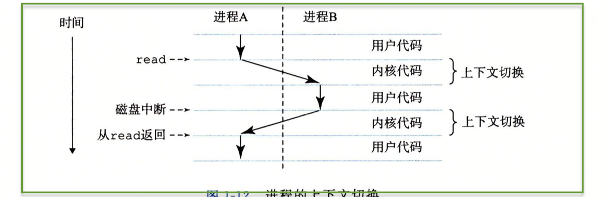
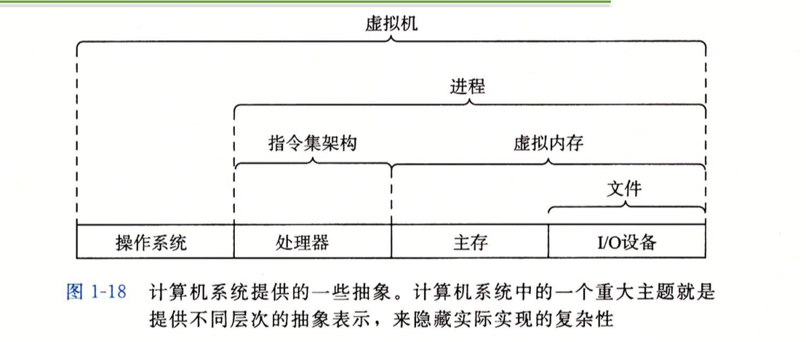

# 计算机系统漫游

## 程序被编译的过程

1. 预处理阶段:根据字符 # 开头的命令，修改原始的 C 程序
2. 编译阶段:输出汇编程序
3. 汇编阶段:汇编器将汇编程序翻译成及其语言指令。汇编器（as）
4. 链接阶段:将系统的标准库合并到目标程序中。连接器（ld）

## 系统的硬件组成

## 运行

    输入命令: shell 程序将字符逐一读入寄存器，再把它放入内存。
    敲击回车:利用DMA（直接存储技术）将目标文件重的代码和数据从磁盘复制到主存。
    加载到主存后，处理器开始执行程序，将输出结果从主存复制到寄存器文件，再从寄存器文件复制到显示器设备，最终显示在屏幕上。

## 高速缓存

    针对处理器和主存的速度差异，系统设计了更小更快的存储设备。被称为高速缓存存储器（cache memory）

## 存储设备的层次结构

## 操作系统

1. 防止硬件被失控程序乱用
2. 向应用程序提供简单统一的机制来控制复杂又不相同的低级硬件设备

## 线程

1. 操作系统将并发执行多个进程时，通过处理器在进程间切换的操作叫做上下文切换
2. 操作系统保持跟踪进程运行所需的所有状态信息，这种状态叫做上下文
3. 内核是操作系统常驻内存的部分，内核不是一个独立的进程，相反，他是系统全部进程所用台吗和数据结构的集合。

## 内存

## 抽象

1. 文件是对 I/O 的抽象
2. 虚拟内存是对程序存储器的抽象
3. 进程是对正在运行的程序的抽象
4. 虚拟机对计算机的抽象

## 名词解释

 单词 | 解释 | 英文 |
 ---- | ---- | --- |
时钟 | 时钟频率越快，完成的时钟周期越多，处理指令就越快||
指令集并行 | 同时执行多条指令的 | |
超标量处理器|大于一个周期一条指令的速度| superscalar|
SIMD并行|一条指令产生多个可以并行执行的操作，这种方式称为单指令，多数据||
